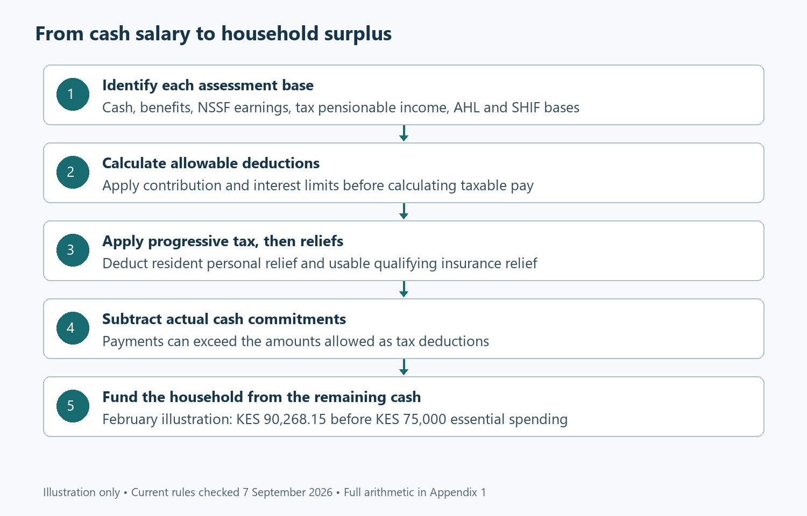

# What your payslip can actually fund

*Kenyan tax and household finance; Part 1 of 4. Rules checked 7 September 2026. All household figures are illustrative. Companion: 01-PAYE-and-Cash-Flow.xlsx and Appendix 1.*

## Begin with the month you have to live through

The most revealing number on a payslip is often the one nobody has labelled. It is the amount still available after deductions, school commitments, rent, medical premiums, pension transfers and the obligations that follow you home from work. A salary increase can arrive alongside a higher contribution, an insurance renewal and a family request, leaving that number almost unchanged. This is where a useful conversation about Kenyan household finance should begin. We need to understand the tax calculation, certainly, but we also need to follow the money beyond payroll. Otherwise, a household can become remarkably efficient at claiming deductions while remaining unprepared for an ordinary interruption in earnings, an unusually expensive term at school, or a bill that cannot wait until payday.

Consider an illustrative employee earning KES 150,000 in monthly cash salary throughout 2026. The employee contributes KES 10,000 to a qualifying private occupational pension, KES 3,000 to a qualifying post-retirement medical fund, and pays KES 5,000 in qualifying insurance premiums each month. Essential spending, including rent, is KES 75,000. There are no taxable non-cash benefits and no mortgage interest in this opening example. Those details matter because they establish a consistent starting point for the workbook. They are assumptions, not a description of the typical Kenyan household. A person with irregular allowances, two employers, a different pensionable salary or business income will need different entries, even if the headline monthly salary happens to be identical.

We will ask five practical questions as we follow this employee through the year. How much cash remains after the actual commitments? Which payments reduce taxable income, and which reduce the tax itself? When does another pension contribution stop producing an additional tax saving? How should income earned outside employment enter the annual reconciliation? Finally, which combination of records would allow someone else to reproduce the calculation without guessing? These questions turn payroll from an opaque monthly event into a system the household can examine. The answer is rarely a single clever deduction. More often, it is a sequence of small distinctions that prevent the same payment, benefit or credit from being counted twice.

The evidence behind this approach is broader than payroll administration. Campbell’s review of household finance describes decisions made under borrowing constraints, imperfect participation and costly financial mistakes [1]. Its relevance here is conceptual: households need arrangements that work when access to money is limited, not merely arrangements that look attractive on an average-return calculation. The paper does not establish the right savings rate for a Kenyan employee, and we should not import one from it. Instead, we can borrow the discipline of considering assets, debts, income and constraints together. A pension balance, a tax deduction and a bank balance contribute differently to household security, even when all three appear under the comforting heading of financial progress.

## Give each payroll number its own job

The first distinction concerns the bases on which deductions are calculated. Cash salary, taxable employment income, pensionable earnings and the earnings assessed for statutory contributions are related concepts, but they need not be identical. A taxable benefit can increase the income used for PAYE without increasing the money credited to a bank account. A contribution ceiling can stop NSSF from rising with every additional shilling of salary. A particular allowance can require its own treatment rather than inheriting the label attached to basic pay. The workbook therefore provides separate entries for cash gross, pre-valued taxable non-cash benefits, NSSF pensionable pay, tax pensionable income, the AHL assessment base and the SHIF assessment base. The equal amounts in the example are a deliberate assumption, not a universal payroll rule.

Kenya’s PAYE system applies progressively higher rates to successive portions of taxable income. The current monthly bands begin with KES 24,000 at 10%, followed by KES 8,333 at 25%, then successive bands at 30%, 32.5% and 35% [2]. Entering a higher band does not apply that higher rate retrospectively to every shilling earned. This matters when someone considers an increment, a promotion or additional work. The relevant question is how the extra earnings interact with tax, contributions and associated costs. A household should calculate the change in available cash rather than interpret the highest rate appearing on the schedule as the fraction of its entire salary that disappears into income tax.

A deduction and a relief act at different points in that sequence. An allowable deduction reduces the income to which the bands apply. A relief reduces the tax calculated from those bands, subject to its conditions and any available tax liability. Under the rules used here, employee AHL, SHIF contributions and qualifying pension, mortgage-interest and post-retirement medical contributions enter the deduction stage [3], [4]. Personal and qualifying insurance relief enter later. We keep these stages visible because combining them under one generic column called tax benefits encourages mistakes. It can make a KES 3,000 payment look like a KES 3,000 tax saving, or allow the same contribution to be treated as both an income deduction and a separate credit.

The household also needs a distinction between a deduction allowed for tax and a payment actually made. Someone can contribute more to a pension than the amount deductible in the current period. The additional contribution still leaves the current account and may still build retirement assets. It simply does not necessarily produce more immediate PAYE relief. Similarly, mortgage principal is a real cash payment even though the mortgage deduction discussed in this series concerns qualifying interest. The companion workbook subtracts actual commitments when calculating available cash and uses separately limited amounts when calculating taxable pay. This gives every payment two possible questions to answer: what happened to the tax calculation, and what happened to the money available for living expenses?

## Follow the February example

February 2026 is an especially useful month for demonstrating the difference. The fourth phase of NSSF contributions raised the lower and upper earnings limits to KES 9,000 and KES 108,000 respectively. At the 6% employee rate, the maximum employee contribution became KES 6,480, with a matching employer contribution [5]. For our employee, that is the amount entering the February cash calculation. The employer’s matching payment is valuable, but it does not become money the employee can spend that month. The model consequently separates the employee cash deduction from the employer obligation. Treating the combined contribution as an employee deduction would understate cash available and misrepresent the employer’s part of the arrangement.

The example uses KES 2,250 for employee AHL and KES 4,125 for SHIF. The latter follows the salaried contribution rule of 2.75% with a KES 300 monthly minimum [6]. These amounts are calculated using the declared assessment bases rather than inferred from the final taxable income. The employee’s NSSF and private pension payments total KES 16,480, which fits within the applicable contribution and income limits in this example. The KES 3,000 qualifying post-retirement medical contribution is considered separately. Adding the allowed deductions produces KES 25,855. Subtracting that total from KES 150,000 leaves KES 124,145 of taxable pay. Appendix 1 expands every step and identifies the workbook cells behind the amounts.

Applying the monthly bands to KES 124,145 produces gross income tax of KES 32,026.85. The example then uses KES 2,400 in resident personal relief and KES 750 of qualifying insurance relief, leaving PAYE of KES 28,876.85. The insurance amount follows the 15% credit on the assumed KES 5,000 qualifying premium, within the overall ceiling [7]. Eligibility is part of the input, not something the spreadsheet can establish from a premium amount alone. The employee must have the relevant evidence, and the model assumes sufficient tax liability to use the credit. These details are small enough to disappear in a casual explanation, but they are precisely what makes a calculation reproducible when someone reviews it later.

The cash calculation now follows a different route. From the KES 150,000 salary, subtract employee NSSF, AHL, SHIF and PAYE, then the actual private pension, post-retirement medical and insurance payments. The result is KES 90,268.15 after those commitments. Subtracting KES 75,000 of essential spending leaves KES 15,268.15. Equation (1.1) gives the accessible version: **household surplus = cash income − tax − actual contributions − other spending**. Its components are expanded in the appendix. This is a useful planning number because it can be allocated only once. If it is simultaneously described as money available for a mortgage deposit, a school-fee reserve and additional pension contributions, the plan has already promised more money than the month produces.

## Watch what changes between months

January illustrates why a full-year schedule is preferable to multiplying the latest payslip by twelve. The preceding NSSF phase used an upper earnings limit of KES 72,000, giving our employee a KES 4,320 contribution before the February change [8]. With the other assumptions unchanged, January PAYE is KES 29,524.85 and cash after the listed commitments is KES 91,780.15. The February employee contribution therefore rises by KES 2,160, but PAYE falls by KES 648 because the larger qualifying contribution reduces taxable pay. Available cash falls by KES 1,512. The household feels a real reduction, although it is smaller than the contribution increase considered alone. The workbook preserves both months rather than overwriting January with the later rate.

Equation (1.2) expresses that movement as **change in spendable cash = −increase in contribution + reduction in PAYE**. Substituting the numbers gives −KES 2,160 + KES 648 = −KES 1,512. This calculation is more informative than saying that tax deductibility makes the additional contribution inexpensive or painless. It shows exactly how much present spending capacity has been exchanged for additional retirement saving. Someone can then compare that exchange with the actual pressures in the household budget. If school costs already consume the available margin, the household may need to change another commitment. If the margin is comfortable, the contribution can be absorbed without disrupting the rest of the plan. The mathematics informs the choice without pretending to make it.

The same method works when a salary increase arrives. Compare the complete before-and-after cash position, including any contribution ceilings already reached and any expenses associated with the new role. A higher commuting bill, relocation or additional childcare can matter as much as the marginal PAYE rate. The workbook’s monthly input sheet allows each month to stand on its own, so a bonus or salary adjustment need not be spread artificially across the year. However, unusual benefits and irregular payments must first be classified correctly. A spreadsheet can apply an entered tax treatment consistently while still producing a misleading result if the treatment itself is wrong. Good modelling therefore begins before the formula, with the employment contract, payment description and relevant supporting records.

There is also a modest rounding issue that deserves a proportionate response. Published monthly PAYE bands use integer amounts, including KES 8,333, while the annual schedule uses KES 100,000 for the corresponding band. Twelve multiplied by 8,333 is 99,996. Under this workbook’s convention, the salary-only monthly total differs from the exact annual-band calculation by KES 0.20 in the example. Appendix 1 shows why. That is a reconciliation item, not evidence of a major payroll failure. The practical lesson is to state the convention, retain calculation precision and investigate differences according to their scale. A twenty-cent discrepancy and an omitted income source deserve different levels of attention, even though both can appear as differences on a reconciliation sheet.

## Test a deduction before increasing the payment

Our employee already contributes KES 16,480 through NSSF and the private pension in February. For this particular earnings level, an additional KES 13,520 takes the combined employee contribution to KES 30,000. The pension deduction is constrained by the actual qualifying contribution, the relevant income test and the monetary ceiling, rather than a fresh ceiling for every account [4], [9]. This is why the sensitivity sheet begins with the total employee contribution. Opening a second pension account does not, by itself, create another full deduction allowance. The administrative arrangement may offer other benefits, but the tax calculation needs to follow the aggregate position. An employee should obtain contribution statements that make that aggregate straightforward to verify.

An extra KES 10,000 pension payment in the February example reduces PAYE by KES 3,000 and available cash by KES 7,000. Equation (1.3) is **net cash cost of extra saving = extra contribution − tax saved**. This is an attractive exchange only in the context of what the household can afford and what the pension arrangement actually provides. The KES 10,000 still becomes a contribution rather than a freely available bank balance. The tax benefit does not remove fund charges, investment risk or access conditions. Part 2 will follow that contribution into the retirement model. Here, the immediate question is narrower: can the employee sustain the resulting reduction in monthly cash without borrowing elsewhere to meet ordinary obligations?

At an extra KES 20,000, the example crosses the remaining deductible headroom. The additional deduction is limited to KES 13,520, generating KES 4,056 in PAYE savings at the relevant marginal rate. The employee still transfers the full KES 20,000, so the immediate cash cost becomes KES 15,944. The sensitivity table makes the change in slope visible: tax savings rise while deductible headroom remains, then flatten. Pension assets continue to receive the extra cash. This is not an argument against contributing beyond the ceiling. It is an argument for describing the reason accurately. Beyond that point, the decision must rest on retirement needs, product terms and alternative uses of money, rather than an additional tax benefit that the model does not produce.

A household with lower earnings may encounter the income-based constraint before the monetary ceiling. Another household may have too little tax liability to use an insurance credit fully. These are different mechanisms, and a generic statement that everyone can save a fixed percentage through tax planning will miss them. The workbook keeps the full progressive calculation in its sensitivity analysis instead of subtracting a constant tax percentage from every additional contribution. A useful test is to change the salary and see whether the saving still behaves as expected. A stronger test is to move the contribution across a limit. If the tax saving continues increasing without regard to that limit, the apparent generosity may be a formula error rather than a feature of the law.

## Bring income outside employment into view

A payslip can be correct while the household’s annual income-tax position remains incomplete. Suppose the employee also earns KES 240,000 of ordinary taxable net income during the year and has KES 12,000 of certified creditable withholding tax. Those amounts enter the annual reconciliation separately. The model does not assume that every bank transfer is income, that every receipt is profit, or that every withholding amount is a credit against the final liability. Classification comes first. A reimbursement, loan repayment, business sale, final-tax receipt and professional fee may require different treatment. The purpose of the additional-income input is to hold an amount that has already been classified, with allowable expenses and the applicable regime considered before it is combined with employment income.

For the illustrative figures, taxable salary income totals KES 1,491,900 for the year. Adding KES 240,000 produces KES 1,731,900. Applying the annual bands and the assumed annual reliefs gives an income-tax liability of KES 419,170. The monthly PAYE total is KES 347,170.20. After the additional KES 12,000 credit, the workbook shows KES 59,999.80 still to reconcile and pay, subject to the stated assumptions. Appendix 1 supplies the manual calculation. The result demonstrates why a certificate showing withholding does not automatically mean that all tax on the related income has been settled. A credit can be real and properly documented while still covering only part of the eventual liability calculated on the combined position.

This creates a practical budgeting task throughout the year. Money received outside employment should not be allocated entirely to spending until its tax character and expected liability have been considered. One approach is to maintain a separate reserve based on an updated annual calculation, then revise it when income or expenses change. The reserve is a household cash arrangement, not a substitute for statutory filing or payment obligations. Different income streams can bring obligations that this salary-focused workbook does not model, including their own reporting or payment rules. The useful discipline is to keep tax money distinguishable from discretionary money. Otherwise, an apparently successful period of extra work can end with a payment demand funded from the emergency reserve that was meant to protect the household.

Dates belong in this process as well. KRA’s published Finance Act 2026 overview identifies a change to the individual annual return deadline from January 2027 [10]. That makes an undated reminder inherited from an older article a weak operational control. The reader should check the deadline applying to the relevant return and distinguish filing from payment, rather than treating them as interchangeable events. The workbook deliberately concentrates on calculation and reconciliation. A separate calendar should record the actual obligations applicable to the taxpayer’s income sources. That separation keeps the model useful without allowing a financial illustration to masquerade as a complete compliance system. A tax position can be arithmetically correct and still require timely action supported by the right records.

## Turn the calculation into a household practice

The first working session should gather evidence rather than hunt for deductions. Start with payslips, the employment terms describing benefits, pension contribution statements, premium certificates, qualifying interest statements and records for income earned outside employment. Match each amount to its period and identify who paid it. This is particularly important where an employer pays a benefit or contributes to a scheme, because an employer expense and an employee cash payment should not be treated as the same event. Then populate one month and reconcile it to the actual payslip. A difference should lead to a question about the base, treatment, timing or rounding. It should not immediately lead to changing a formula until the workbook happens to reproduce the expected number.

Once the baseline works, use the pension sensitivity sheet to explore a decision the household is genuinely considering. Try an additional contribution, identify the tax saving and compare the remaining cash with realistic spending. Then repeat the exercise under a less comfortable month. Perhaps school costs rise, a household member needs support or an insurance premium is paid annually rather than evenly each month. The salary model can show an average monthly allowance while the bank account still experiences a large payment on one date. Converting an annual expense into a monthly saving provision can help, but the provision must accumulate before the bill arrives. A smooth spreadsheet line cannot itself solve a timing mismatch between receipts and payments.

A useful reserve policy begins with the household’s obligations rather than an unexplained target copied from elsewhere. Identify spending that would continue during an interruption, amounts that can be reduced quickly, and commitments that carry penalties or consequences if missed. The medical model in Part 3 will examine an interruption occurring alongside a claim, because those events can interact. For the present employee, the KES 15,268.15 February surplus gives a starting contribution capacity. Allocating all of it to long-term saving would build assets while leaving no new margin for short-term surprises. Allocating none of it would preserve flexibility today while postponing future needs. The workable arrangement is a sequence that reflects the household’s current reserve, debts, dependants and employment stability.

The workbook should also be challenged at its boundaries. Enter a lower salary, increase a contribution beyond its deductible limit, remove qualifying insurance premiums and examine a month with different pensionable earnings. Check whether the outputs respond in the expected direction and whether earlier months remain unchanged. The formula dictionary explains the representative calculation families, while the appendix translates their notation and expands the numerical examples manually. These are complementary forms of transparency. A reader who prefers a spreadsheet can trace the cells, and a reader who wants to understand the arithmetic can follow the expansion without trusting the software. Neither approach establishes the legal eligibility of an input, which remains a separate evidence question for the taxpayer and the relevant provider.

There is a limit to what optimisation should try to accomplish. Buying a policy solely for a tax credit, taking a mortgage solely for an interest deduction or locking away an unaffordable contribution can improve one line in the tax calculation while weakening the household overall. The correct comparison includes the full payment, the benefit obtained, the access conditions and the alternative use of the same money. That is why this series moves from payroll to pension assets, medical protection and housing commitments. Each decision changes both current cash and future possibilities. Examining them separately helps explain the mechanics, but bringing them together is necessary before deciding whether the entire arrangement can survive an interruption without expensive borrowing or forced asset sales.

At the next payday, the employee in our example can ask a more useful question than whether PAYE looks high. The question is whether the KES 90,268.15 remaining after the listed commitments is being assigned deliberately, whether the KES 15,268.15 surplus is real after all ordinary spending, and whether outside income has a corresponding tax reserve. That conversation is concrete enough to lead to action. It may produce a higher pension contribution, a stronger cash buffer, corrected payroll documentation or a revised household commitment. The calculation has done its job when those choices become visible and comparable. Part 2 takes the next step: following pension contributions through charges, inflation and uncertain returns to examine what they might eventually fund.

## References

[1] J. Y. Campbell, “Household finance,” *The Journal of Finance*, vol. 61, no. 4, pp. 1553–1604, 2006, doi: [10.1111/j.1540-6261.2006.00883.x](https://doi.org/10.1111/j.1540-6261.2006.00883.x).

[2] Kenya Revenue Authority, “Pay As You Earn (PAYE).” [Online]. Available: [KRA PAYE](https://www.kra.go.ke/individual/filing-paying/types-of-taxes/paye). Accessed: Sep. 7, 2026.

[3] Kenya Revenue Authority, “Allowable deductions.” [Online]. Available: [KRA FAQ 732](https://www.kra.go.ke/component/kra_faq/faq/732). Accessed: Sep. 7, 2026.

[4] Republic of Kenya, *Tax Laws (Amendment) Act, No. 12 of 2024*, secs. 7–10, 2024. [Online]. Available: [Kenya Law](https://www.kenyalaw.org/kl/fileadmin/pdfdownloads/Acts/2024/TheTaxLaws_Amendment_Act_No.12of2024.pdf). Accessed: Sep. 7, 2026.

[5] National Social Security Fund, “Notice to employers, Year 4 (2026) NSSF contribution rates,” 2026. [Online]. Available: [Official notice hosted by MyGov](https://www.mygov.go.ke/sites/default/files/2026-02/Notice%20To%20Employers%20%E2%80%94%20Year%204%20%282026%29%20NSSF%20Contribution%20Rates%20.pdf). Accessed: Sep. 7, 2026.

[6] Republic of Kenya, *Social Health Insurance Regulations, Legal Notice No. 49 of 2024*, reg. 17. [Online]. Available: [Kenya Law](https://new.kenyalaw.org/akn/ke/act/ln/2024/49/eng%402024-03-08). Accessed: Sep. 7, 2026.

[7] Kenya Revenue Authority, “Tax reliefs,” FAQ 733. [Online]. Available: [KRA](https://www.kra.go.ke/component/kra_faq/faq/733). Accessed: Sep. 7, 2026.

[8] National Social Security Fund Uganda, “Kenya, NSSF increases contributions rates,” Feb. 6, 2025. [Online]. Available: [NSSF](https://www.nssfug.org/savings-digest/kenya-nssf-increases-contributions-rates/). Accessed: Sep. 7, 2026.

[9] Republic of Kenya, *Income Tax Act, Cap. 470*, secs. 22A–22B, consolidated Jul. 1, 2025, read with subsequent amendments. [Online]. Available: [Kenya Law source](https://new.kenyalaw.org/akn/ke/act/1973/16/eng%402025-07-01/source). Accessed: Sep. 7, 2026.

[10] Kenya Revenue Authority, “Finance Act 2026: What it means for you.” [Online]. Available: [KRA](https://www.kra.go.ke/finance-act-2026-what-it-means-for-you). Accessed: Sep. 7, 2026.
