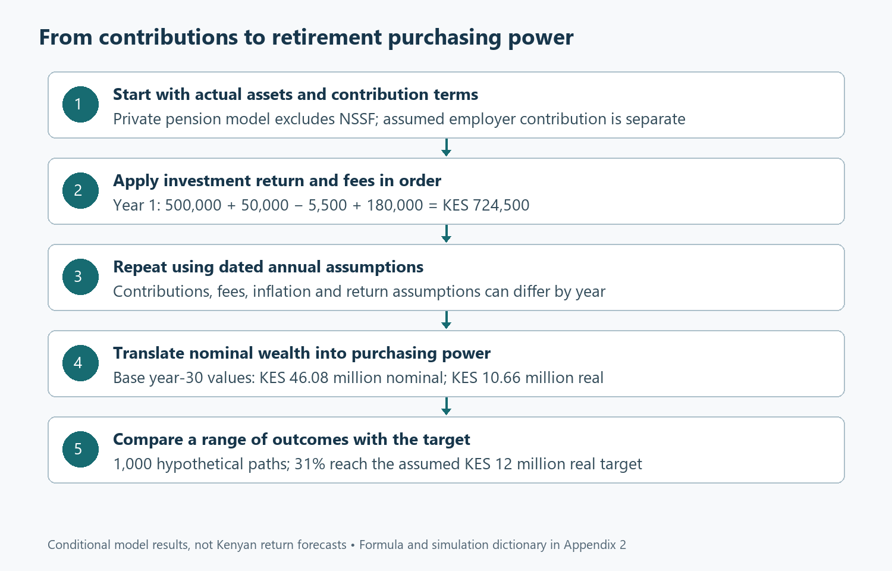
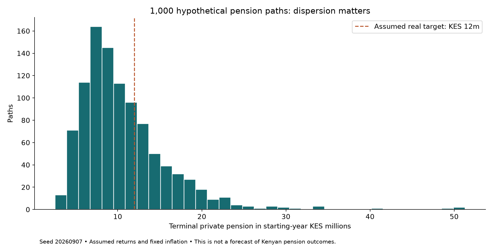

# Building a pension that can pay for life

*Kenyan tax and household finance; Part 2 of 4. Rules checked 7 September 2026. All projections are illustrative. Companion: 02-Pensions-and-Retirement.xlsx and Appendix 2.*

## Start with the life the money must support

A pension statement can show progress while leaving the most important question unanswered. The balance may have increased, contributions may be up to date and the investment return may look respectable, yet the household still does not know what that money could support after employment ends. Retirement planning becomes more useful when it begins with future spending rather than a contribution target chosen because it sounds disciplined. Housing, food, transport, family support and healthcare will continue in different proportions. Some work-related costs may fall. Other costs may rise or become less predictable. The task is to connect today’s saving with that future pattern of obligations, while acknowledging that the dates, prices and investment outcomes will not arrive exactly as projected.

Part 1 followed a contribution through the payslip. An additional qualifying pension payment could reduce PAYE while still reducing cash available for current spending. We now follow the money after it reaches the pension arrangement. This creates five questions. How much is being accumulated, including any employer contribution? What happens after charges and inflation? How strongly does the result depend on continuing contributions? How wide is the range of plausible outcomes under a stated model? Finally, what additional work is needed before a capital balance can be translated into retirement income? Each question adds information that a single return figure cannot provide. Together, they make it possible to discuss pension adequacy without promising a future that a spreadsheet cannot guarantee.

The illustrative private pension starts with KES 500,000. The employee contributes KES 120,000 during the first projection year and the employer adds KES 60,000. Both contributions increase by 5% annually, with money entering at year end. The deterministic gross return assumption is 10% annually, the investment fee is 1%, and inflation is 5%. These are declared modelling choices rather than current product quotes, historical Kenyan averages or forecasts. The workbook provides a separate assumption for each year, so a reader can introduce a contribution pause, a different charge or a later change in inflation. Thirty years of smooth inputs are convenient for understanding the mechanics, but they should never be confused with thirty years of predictable household circumstances.

The private pension projection deliberately excludes the employee’s NSSF benefits. That keeps the employer contribution assumed for this private arrangement distinguishable from statutory NSSF matching and avoids assigning the same investment process to two different arrangements. A complete retirement plan should incorporate the person’s actual NSSF record and benefit expectations separately, alongside any other pension, rental or financial income. The distinction matters because a contribution appearing on a payslip does not establish the future benefit rules, investment crediting or access terms of every scheme. Combining different arrangements is useful only after their treatment has been understood. Until then, a clearly labelled partial model is more informative than a comprehensive-looking balance assembled from incompatible assumptions about contributions, returns and benefits.

## Understand the tax incentive without letting it choose the product

Current Kenyan rules permit deductions for qualifying pension contributions within the relevant limits, including the monetary ceiling raised by the Tax Laws Amendment Act of 2024 [1]. The underlying income test and aggregation provisions also matter [2]. For the employee in Part 1, the immediate tax saving on an additional KES 10,000 contribution was KES 3,000, leaving a KES 7,000 reduction in spendable cash. That is a useful starting comparison. It does not determine which pension arrangement to choose, how much to contribute over a lifetime or whether the household can safely commit the money today. Those decisions require the next layer of information: employer terms, scheme registration, charges, investment policy, portability, administration and the conditions governing access to benefits.

One particularly useful question is whether an additional employee contribution attracts additional employer money. The answer comes from the actual employment and scheme terms. The KES 60,000 employer contribution in our model is an illustrative contractual assumption, not a statutory entitlement applying to every private pension plan. Where matching is available, the employee should understand its ceiling, contribution basis and any relevant vesting or departure provisions before modelling it as their asset. Where no matching is available, the model should show zero. This seems obvious, but treating an assumed employer contribution as an automatic feature can materially overstate retirement capital. A small input with an optimistic label can compound for decades and eventually dominate the apparent success of a plan.

Registration and taxation deserve their own evidence check. The Retirement Benefits Authority provides information on registered schemes and explains current pension taxation and qualifying benefit conditions [3]. That evidence helps establish what arrangement the employee is joining and which rules need to be discussed with its administrator. It does not make every investment result certain or every withdrawal interchangeable. Our accumulation workbook reports pension assets before any benefit-specific withdrawal tax and does not simulate an early exit. Before using the balance as spendable retirement money, the reader must confirm the relevant retirement circumstances, scheme rules and current tax treatment. A capital projection is therefore one stage in the decision, followed by a separate benefit-access and income-planning stage that depends on the member’s actual position.

Research on retirement saving also gives us reason to look beyond the headline tax incentive. Chetty and colleagues’ study of Danish retirement accounts distinguishes active responses to incentives from saving generated through more passive mechanisms [4]. One implication is that moving money into a pension account can reflect reallocation of existing saving rather than an equal increase in the household’s total wealth. That is a useful question to ask in Kenya, although the study does not supply a Kenyan response estimate. When a contribution rises, what finances it? Lower consumption, reduced liquid saving, the sale of another asset and additional borrowing have very different consequences. The pension account alone cannot reveal which of those adjustments the household has made elsewhere in its finances.

## Make the annual calculation visible

The first year in the workbook begins with KES 500,000. A 10% gross investment return adds KES 50,000. The assumed 1% fee is then charged on KES 550,000, producing a KES 5,500 charge. The employee and employer add KES 180,000 at year end, leaving KES 724,500. Equation (2.1) states the sequence in accessible terms: **closing pension = opening pension + investment gain − fees + contributions**. Appendix 2 expands the multiplication and identifies the exact fee and contribution timing. That timing is part of the model. A provider that charges differently or credits contributions monthly will produce a different result even when its quoted annual return and total annual contribution appear to match our assumptions.

This is why the workbook does not simply subtract one percentage point from the gross return and declare the remaining rate exact. With the specified timing, a 10% gross return followed by a 1% fee produces an 8.9% net growth factor on the opening assets: 1.10 multiplied by 0.99 equals 1.089. A subtraction shortcut would give 9%. The difference looks small in one year, but repeated compounding makes small differences worth describing accurately. That does not mean every conversation needs to lead with algebra. The body can explain that the fee is charged after the gain, while the appendix carries the precise formula. Readers can then decide how deeply to inspect the calculation without losing sight of the decision it supports.

The deterministic path ends with approximately KES 46.08 million after thirty years. That is the nominal account balance under the stated assumptions. It is an impressive-looking number, but the household will spend it at future prices. With 5% inflation each year, the cumulative price factor is about 4.322. Dividing the projected balance by that factor leaves approximately KES 10.66 million in starting-year purchasing power. Equation (2.2) gives the interpretation: **purchasing power = future balance ÷ cumulative rise in prices**. The workbook shows both amounts together because a nominal balance can grow substantially while its practical meaning is obscured. Appendix 2 supplies the full inflation calculation and a closed-form check on the contribution model under the constant-rate assumptions.

Inflation does more than change the label attached to the final balance. It changes what contributions and spending targets mean during the journey. In this example, contributions rise by the same 5% rate assumed for inflation, so their real value is approximately maintained. If nominal contributions remained unchanged while prices rose, the employee would gradually save less in purchasing-power terms. Conversely, increasing contributions faster than inflation requires the household to find a growing real amount from its earnings. The annual assumption grid makes this visible. It should be populated with a contribution path the household might actually sustain, rather than the path needed to make the final balance look sufficient. Feasibility belongs alongside adequacy from the beginning of the exercise.

## Decide what a target really means

The workbook uses KES 12 million in starting-year purchasing power as an illustrative target. It is a capital benchmark selected for testing, not a recommendation that this amount is enough for retirement. To turn it into an income plan, the reader would need to specify retirement age, spending, household composition, other income, benefit-access terms and the period the money must support. An annuity quotation would introduce provider pricing and contractual benefits. A drawdown arrangement would introduce investment and depletion risks after retirement. The target is therefore useful as a question: how often does the model accumulate this stated amount? It cannot answer a different question about whether the amount will fund a particular lifestyle for an unknown number of future years.

Equation (2.3) offers a simple bridge to that later conversation: **annual spending gap = desired retirement spending − dependable other income**. Suppose, purely as an illustration, desired spending is KES 900,000 a year in today’s money and dependable other income is KES 300,000. The annual gap is KES 600,000. A KES 12 million capital balance is twenty times that first-year gap. The ratio is descriptive, not a safe withdrawal guarantee. Future spending, longevity, investment returns, charges and taxes can change the outcome. Appendix 2 develops the relationship and explains why multiplying one year’s gap by a fixed number is only an initial organising device. The household still needs a separate analysis of how benefits would actually be received and spent.

The same distinction applies to a projected pension shortfall. A deterministic result below the target does not mean the employee has failed, and a result above it does not establish that the plan is secure. It identifies a gap under one particular path. Several responses may be available: increasing contributions, extending the saving period, changing costs, revising retirement spending or improving the reliability of other income. These responses should be evaluated for feasibility and risk. Raising the assumed return is also easy to do in a spreadsheet, but it does not itself improve the household’s position. A more useful adjustment changes something the household can influence or explicitly recognises a risk it is choosing to carry, rather than merely making the projection more flattering.

## Let returns vary and examine the range

The Monte Carlo sheet replaces the identical annual return with 1,000 sequences of hypothetical returns. The assumed arithmetic mean remains 10%, while the standard deviation of annual log returns is 12%. Returns are modelled through a lognormal gross-return factor so that the investment factor remains positive. The appendix gives the transformation, including the adjustment needed to preserve the stated arithmetic mean. Contributions, charges and inflation continue to follow their dated assumptions. This is a controlled experiment in uncertainty, not a claim that Kenyan pension returns follow this distribution exactly. Glasserman’s treatment of Monte Carlo methods provides the methodological foundation for examining simulated outcomes and their sampling uncertainty [5]. The household interpretation comes from the cash flows and assumptions we place inside that method.

The fixed simulation produces a median real terminal balance of approximately KES 9.47 million. The tenth percentile is about KES 5.50 million and the ninetieth percentile about KES 17.23 million. These are outcomes from the specified model, with all its assumptions, rather than historical estimates of what Kenyan employees should expect. Their value is that they prevent the deterministic KES 10.66 million figure from carrying the entire conversation. A household can now see a wide difference between relatively weak and relatively strong investment paths. It can ask whether the lower outcomes would still leave room for essential spending, what additional resources might exist, and how much flexibility remains if retirement arrives after a disappointing sequence of returns.

The median falls below the deterministic expected-wealth result because compounded wealth is unevenly distributed. A relatively small number of strong paths can raise the mean above the middle outcome. That is a feature worth explaining in ordinary language before displaying a complicated distribution. Saying that the average outcome reaches a particular amount can leave readers imagining that half the paths should finish above it and half below. That interpretation belongs to the median, not necessarily the mean. The workbook keeps the distinction visible. The deterministic path is labelled according to its model interpretation, while the simulation reports a median and selected percentiles. The appendix explains the mathematics without requiring the main article to become a lecture on probability distributions.

In the fixed run, 31.0% of paths reach the KES 12 million real target. The estimated sampling standard error is approximately 1.46 percentage points. A simple normal approximation gives an interval of roughly 28.1% to 33.9% for simulation sampling uncertainty. Those figures describe variation from drawing a finite number of paths under the chosen model. They do not measure uncertainty about whether the assumed return, volatility, inflation or contribution path is appropriate. That second source of uncertainty can be much larger. The workbook states the distinction because a probability displayed to one decimal place can otherwise look more authoritative than its inputs justify. Precision in reporting should make the model easier to inspect, not make its assumptions disappear.

## Stress the assumptions that might fail together

The simulation also reports its first and second batches of 500 paths. Their target-reaching proportions are 33.6% and 28.4%, respectively. The difference is a practical reminder that one finite sample contains noise. Using a fixed seed preserves the same draws when contributions or fees change, which makes comparisons easier to interpret. A changed outcome can then be attributed to the changed assumption rather than an entirely new random sample. However, the chosen pseudorandom sequence is a reproducibility device, not economic evidence. Increasing the number of trials can reduce sampling noise but cannot repair an unsuitable model. The first question remains whether the simulated events and relationships represent the decision being examined well enough to inform it.

Some important relationships are intentionally absent from the base simulation. Annual returns are independent, inflation is deterministic and contributions continue along the entered schedule. In practice, earnings disruption can coincide with weak markets, inflation can be unpredictable and a household may reduce contributions precisely when the investment environment is difficult. These interactions can weaken the reassurance provided by a smooth contribution path. The dated assumption grid allows contribution pauses and higher inflation to be tested directly. It does not turn the independent-return model into a fully estimated economic system. The appendix lists the omissions so a reader can judge where more sophisticated modelling would add value. Complexity is useful when it answers a real question, not merely when it produces more impressive-looking mathematics.

Consider a contribution interruption in year ten. Set that year’s employee and employer amounts to zero, leaving the preceding years unchanged. The immediate loss is the missed contribution, but the eventual loss also includes the growth that contribution would have earned over the remaining years. Restoring contributions in year eleven does not automatically recover the missing capital. The same exercise can be repeated for several years or combined with a weaker return assumption. This is a more realistic discussion of resilience than assuming that a household can always compensate later. Catch-up saving requires future income and available cash, which may already have other claims on them. The workbook allows the reader to quantify the gap before deciding whether a catch-up plan is feasible.

Fees deserve a similar test because they affect every year in which assets remain invested. The fee sensitivity sheet adds different charges to the dated base fee and recalculates the full accumulation path. It does not reduce the final balance by a single percentage after the fact. That difference matters because charges also remove money that could have earned later returns. The right comparison between providers must consider the actual fee schedule, service, investment arrangement and any guarantees or restrictions, rather than assume that the lowest visible charge settles the choice. Nevertheless, a persistent charge should earn its place in the decision. A household can ask the provider to explain what is being charged, on which balance, at what time and for which service.

## Keep current liquidity in the retirement conversation

The employee can also use the contribution multiplier to test a larger saving commitment. Raising it increases both employee and assumed employer contributions in this workbook, so a reader must adjust the employer entries if matching would not increase in reality. This is a good example of an apparently simple control that deserves careful interpretation. The resulting pension balance may improve substantially while current cash becomes too tight. Part 1 provides the complementary calculation of the immediate cash cost after tax. The two workbooks are independent files and do not exchange live values, which means any revised contribution must be entered consistently in both. That explicit transfer encourages the user to inspect what changed rather than rely on an unnoticed external spreadsheet link.

A household should be especially cautious when increasing pension saving while carrying expensive short-term debt or holding very little accessible cash. This is not a universal instruction to postpone retirement saving until every other objective is complete. It is an invitation to compare the actual trade-offs, including employer terms and the consequences of losing contributions that would otherwise be matched. Campbell’s household-finance framework is useful here because it places financial decisions alongside borrowing constraints and background circumstances [6]. Money inside a pension arrangement and money available for an urgent bill perform different jobs. The household may need both, and the order in which it builds them should reflect the costs and risks of being short of either one at the wrong time.

Healthcare introduces another reason to separate purposes. A post-retirement medical fund can support a different future obligation from a general pension, while still competing for current contribution capacity. Kenya’s 2026 PRMF framework provides dedicated structures and access conditions, according to the Retirement Benefits Authority [7]. Part 3 examines those arrangements alongside present medical protection and emergency reserves. For now, the important point is that allocating money to a named purpose does not make the underlying cash constraint disappear. If the same future medical expenditure is included in both a pension target and a separate medical-fund target, the household may overstate what it needs. If it appears in neither, the apparent retirement plan may have a substantial gap hidden beneath a complete-looking balance.

## Read the statement as evidence, not reassurance

A productive annual review begins by comparing actual contributions, charges and balances with the model. Differences should be explained rather than smoothed away. Did the employee contribute less than planned? Did the employer contribution follow a different basis? Were there additional charges? Was the return quoted before or after fees? A statement can contain several figures that sound like investment performance while measuring different things. The workbook’s dictionary identifies the definitions used in this series, including the contribution timing and the balance on which the fee is charged. Matching those definitions to the provider’s statement is more valuable than selecting whichever published return makes the model look closest. The objective is a consistent account of what happened and what assumptions should change next.

The review should also revisit the retirement target in current purchasing power. A household may have paid off housing debt, taken on new dependants, changed its expected retirement date or discovered that a supposedly dependable income source is less secure. These developments can matter more than a small change in the latest investment return. The model should respond to the life being financed. That includes acknowledging objectives that are difficult to quantify, such as helping adult children, supporting relatives or retaining the ability to move. Some readers will prefer a detailed spending schedule, while others will begin with a simpler annual gap. Both approaches can work if the assumptions are explicit and the uncertainty is treated as part of planning rather than an inconvenience to hide.

Before accepting a projection, inspect a few boundary cases. Set the gross return and fee to zero and verify that capital grows only through contributions. Remove the employer payment and confirm that it no longer appears in the balance. Increase inflation and check that real wealth falls even if nominal wealth is unchanged. Introduce a later-year contribution pause and verify that earlier years remain intact. These tests make the workbook more trustworthy because they examine its behaviour rather than merely admiring its final number. Appendix 2 provides independent manual checks and the random-number method, while the formula dictionary maps each modelling sheet to its mathematical equivalent. A reader can therefore challenge both the arithmetic and the assumptions without rebuilding the entire model.

The useful outcome is a retirement plan that the household can maintain, explain and revise. In our example, the deterministic path produces about KES 10.66 million in today’s purchasing power, while the simulation shows a much wider range and a 31.0% target-reaching rate under its specified assumptions. That combination creates a concrete discussion about contributions, charges, retirement timing and spending flexibility. It does not demand that the household chase a higher return to close every gap. It asks which adjustments are affordable, which risks are acceptable and which promises require further evidence from the scheme. Part 3 turns to the obligation that often disrupts both present cash and retirement plans: paying for healthcare while protecting the household from an interruption in earnings.

## References

[1] Republic of Kenya, *Tax Laws (Amendment) Act, No. 12 of 2024*, secs. 8–9, 2024. [Online]. Available: [Kenya Law](https://www.kenyalaw.org/kl/fileadmin/pdfdownloads/Acts/2024/TheTaxLaws_Amendment_Act_No.12of2024.pdf). Accessed: Sep. 7, 2026.

[2] Republic of Kenya, *Income Tax Act, Cap. 470*, secs. 22A–22B, consolidated Jul. 1, 2025, read with subsequent amendments. [Online]. Available: [Kenya Law](https://new.kenyalaw.org/akn/ke/act/1973/16/eng%402025-07-01/source). Accessed: Sep. 7, 2026.

[3] Retirement Benefits Authority, “What you need to know about saving for retirement,” Sep. 10, 2025. [Online]. Available: [RBA](https://www.rba.go.ke/what-you-need-to-know-about-saving-for-retirement/). Accessed: Sep. 7, 2026.

[4] R. Chetty, J. N. Friedman, S. Leth-Petersen, T. H. Nielsen, and T. Olsen, “Active vs. passive decisions and crowd-out in retirement savings accounts: Evidence from Denmark,” *The Quarterly Journal of Economics*, vol. 129, no. 3, pp. 1141–1219, 2014, doi: [10.1093/qje/qju013](https://doi.org/10.1093/qje/qju013).

[5] P. Glasserman, *Monte Carlo Methods in Financial Engineering*. New York, NY, USA: Springer, 2004, doi: [10.1007/978-0-387-21617-1](https://doi.org/10.1007/978-0-387-21617-1).

[6] J. Y. Campbell, “Household finance,” *The Journal of Finance*, vol. 61, no. 4, pp. 1553–1604, 2006, doi: [10.1111/j.1540-6261.2006.00883.x](https://doi.org/10.1111/j.1540-6261.2006.00883.x).

[7] Retirement Benefits Authority, “Bridging the post-retirement healthcare gap: A guide to Kenya’s 2026 PRMF regulations,” Aug. 25, 2026. [Online]. Available: [RBA](https://www.rba.go.ke/bridging-the-post-retirement-healthcare-gap-a-guide-to-kenyas-2026-prmf-regulations/). Accessed: Sep. 7, 2026.
