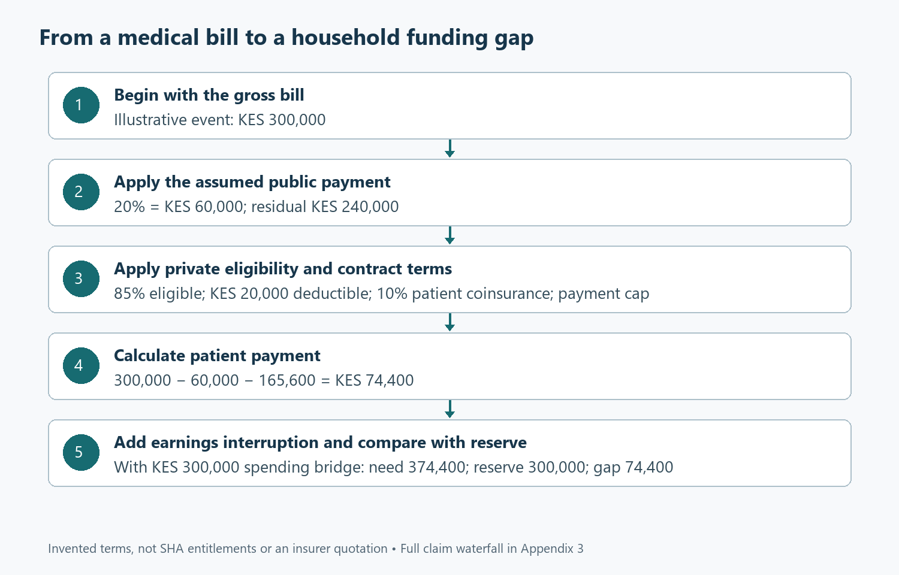
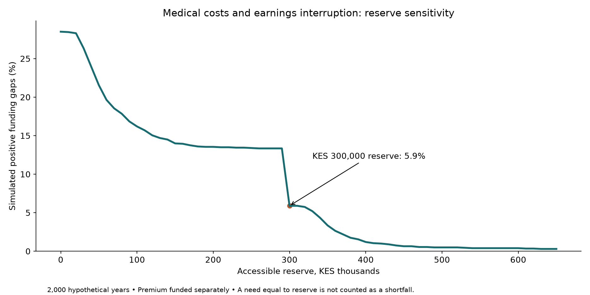

# Paying for healthcare without unravelling the household

*Kenyan tax and household finance; Part 3 of 4. Rules checked 7 September 2026. Policy terms and all claim probabilities below are hypothetical. Companion: 03-Medical-and-Emergency-Funds.xlsx and Appendix 3.*

## Follow the money after the hospital bill arrives

Medical protection becomes real at an inconvenient moment. Someone needs treatment, the family needs information, and the household must discover which payments can be made immediately. A policy schedule may show a substantial benefit limit while the hospital asks for an amount that remains the patient’s responsibility. At the same time, transport costs rise, somebody misses work and ordinary household bills continue. A useful financial plan needs to follow that whole sequence. It should explain what public cover is expected to pay, what a private policy will recognise, what the patient must fund and how quickly the money is available. The starting question is therefore wider than whether a family has insurance: what would actually happen to its cash if care became necessary this month?

The first two articles established the household’s current surplus and examined the pension assets intended for later life. This article connects those decisions to medical risk through five questions. Which payments belong to statutory health financing, private insurance, emergency saving and retirement medical saving? How do deductibles, exclusions, coinsurance and benefit limits change the patient’s bill? What happens when treatment coincides with lost earnings? How sensitive is the household’s position to the size of its accessible reserve? Finally, which assumptions require a provider’s confirmation before the model can be used for a real policy comparison? These questions keep the focus on the obligation the family must meet rather than the headline size of the cover it has purchased.

Kenyan research provides a strong reason to take the cash consequences seriously. Salari and colleagues examined the catastrophic and impoverishing effects of out-of-pocket healthcare payments using 2018 household data [1]. The study identifies financial protection as a substantive household issue, with burdens differing across circumstances. Its date is important. It predates the current SHA arrangements and cannot tell us whether a particular 2026 benefit package will pay a present claim. We use it to support the need to examine residual costs, not to calibrate the probabilities in our workbook or evaluate reforms it did not observe. That distinction allows historical evidence to inform the problem without being asked to answer a newer operational question beyond its scope.

Our illustrative household pays KES 60,000 annually for private medical insurance and keeps KES 300,000 in an accessible reserve after funding that premium separately. Essential spending is KES 75,000 a month. The example assumes sufficient income-tax liability to use qualifying insurance relief and no competing qualifying premium using the same ceiling. The policy terms, claim size and payment assumptions introduced below are invented scenarios for modelling, not quotations from an insurer or representations of SHA entitlements. This explicit starting point matters because policy comparisons often fail at the first step: the products may cover different people, providers, conditions or services, even when the premiums and headline limits appear directly comparable. The workbook is a framework for entering confirmed terms consistently.

## Separate four different uses of money

For a salaried household, the statutory SHIF contribution belongs in the payroll calculation. The regulations specify the salaried contribution formula, including the monthly minimum [2]. Paying that contribution and determining what a specific treatment will receive are related but separate questions. Eligibility, service rules, the provider and the applicable benefits need to be established for the actual case. The workbook therefore does not infer a hospital payment directly from the employee’s salary deduction. Instead, it accepts an explicitly assumed public payment for the scenario. This prevents a common modelling leap in which paying into a system is treated as proof that an arbitrary percentage of every future bill will be covered under identical conditions and without further verification.

Private insurance introduces a second set of terms. A policy can specify a network, authorisation requirements, waiting periods, exclusions, sublimits, deductibles and patient participation in costs. The order in which these terms apply can change the final amount substantially. Our model uses one declared sequence so the arithmetic can be inspected, but a real policy may use another. Before comparing products, ask for the wording that governs payment, not only a marketing summary. Identify whether a limit refers to the insurer’s payment or the billed service, whether a deductible is annual or per event, and whether several family members share a benefit. These questions are practical inputs to the calculation. Without them, precise numbers can conceal an inaccurate description of the contract.

The third use of money is an emergency reserve. It can pay costs that remain outside cover, bridge delays and fund ordinary spending when earnings are interrupted. It does not pool risk across policyholders or promise a benefit beyond the amount saved. Its strength is availability and flexibility, provided the asset can actually be accessed when needed. That makes the reserve different from both an insurance premium and a pension contribution. A premium purchases contractual protection; a pension contribution builds assets subject to its own rules; a reserve remains available for current contingencies. All three can be valuable. Their amounts should be considered together, because increasing one by drawing down another can improve one form of protection while weakening the household at a different point in the sequence.

Post-retirement medical saving is the fourth use. Kenya’s Retirement Benefits Authority describes a dedicated framework under the 2026 PRMF regulations, including stand-alone medical funds and internal funds within occupational schemes [3]. Those arrangements address future medical funding and have access conditions that differ from an ordinary savings account. The tax deduction for qualifying PRMF contributions is also separate from the insurance-premium relief mechanism [4]. The immediate household implication is straightforward: a contribution intended for retirement healthcare should not automatically be counted as cash available for this year’s hospital bill. A complete plan can include both, but it should assign each amount to the period and purpose it can actually serve rather than group everything under a single reassuring total called medical provision.

## Calculate what remains the patient’s responsibility

Take a hypothetical gross medical bill of KES 300,000. For this scenario only, assume public cover pays 20%, or KES 60,000, leaving KES 240,000. Assume the private policy recognises 85% of that residual bill as eligible, giving KES 204,000. The remaining 15% is not silently discarded; it remains part of the patient’s eventual obligation. Next, apply a KES 20,000 deductible to the eligible amount. That leaves KES 184,000 to which the coinsurance rule applies. The workbook shows each step in a separate column. This arrangement is more informative than inserting a single percentage labelled insurance cover because it reveals which contractual assumption is responsible for each part of the patient’s bill.

The scenario assigns 10% patient coinsurance after the deductible. The private insurer therefore pays 90% of KES 184,000, or KES 165,600, below the assumed KES 500,000 payment limit. The patient’s bill is KES 74,400: KES 300,000 less KES 60,000 of public payment and KES 165,600 of private payment. Equation (3.1) is **patient payment = gross bill − public payment − private payment**. Appendix 3 expands the eligibility, deductible and coinsurance steps that sit behind it. The result shows why a large headline limit does not necessarily remove a material cash requirement. In this case, the limit is not even binding. The residual comes from the assumed uncovered share, deductible and patient participation in eligible costs.

Now increase the hypothetical bill to KES 1 million while leaving the other assumptions unchanged. Public payment becomes KES 200,000 under the deliberately simplified scenario. The eligible private residual becomes KES 680,000. After the deductible and coinsurance, the uncapped private payment would be KES 594,000, but the KES 500,000 payment limit binds. The patient is left with KES 300,000, equal to the household’s opening reserve. These figures are model outputs, not expected payments under a real policy. They demonstrate the importance of testing a large claim rather than inspecting only the example that fits comfortably inside the limit. A contract can perform as written and still leave the household with an amount that is difficult to finance.

Premiums need to enter the household comparison as well. With the assumed qualifying KES 60,000 annual premium, sufficient tax liability and no competing premium, the 15% insurance relief is KES 9,000 [5]. The net annual premium cost is therefore KES 51,000. Combining that cost with the KES 74,400 patient bill in the first scenario produces KES 125,400 for that illustrated claim year, excluding SHIF already included in payroll. Equation (3.2) states **annual private medical cost = premium − usable tax relief + patient bill**. The word usable matters. A household that has exhausted the relief ceiling through other qualifying policies or lacks sufficient tax liability should not receive the same assumed saving simply because the medical premium is identical.

## Add the earnings interruption

The hospital bill is only one route through which illness can affect household cash. Suppose the household must fund four months of essential spending at KES 75,000 while earnings are unavailable. That creates KES 300,000 of spending to finance, before any residual medical bill. Combining it with the KES 74,400 patient payment from the first claim scenario produces KES 374,400. Against a KES 300,000 reserve, the gap is KES 74,400. Equation (3.3) expresses the relationship: **funding gap = combined cash need − accessible reserve**, with a floor of zero. Appendix 3 makes the calculation explicit and explains the treatment of other income. The example assumes none, so severance, a partner’s earnings or another dependable payment would need to be entered deliberately.

That example also clarifies why reserves should be measured against the spending that continues during a disruption. Dividing KES 300,000 by KES 75,000 gives four months of simple expenditure coverage. The same reserve will last less time if it first pays a large medical balance, and longer if essential spending can fall or another income continues. The workbook’s reserve sensitivity includes this simple runway measure alongside a more demanding combined-risk calculation. The two answer different questions. The runway ratio describes a straightforward spending bridge with no new medical event. The simulation asks whether medical costs and an earnings interruption together exceed the available reserve. Keeping the measures separate prevents a familiar four-month label from being mistaken for protection against every combination of events.

The timing of insurance payments can create another gap even where the eventual reimbursement is adequate. If the patient must pay first and claim later, the family needs temporary financing for an amount larger than its final economic cost. The base workbook models final annual payments rather than a detailed calendar of hospital deposits and reimbursements. A real household should add a dated cash schedule for any policy that relies materially on reimbursement. The distinction is important: final affordability and immediate liquidity are not the same. A claim can be valid, the insurer can ultimately pay and the household can still face a difficult financing problem in the intervening weeks. Provider arrangements and claims administration therefore belong in the financial comparison alongside premiums and benefit limits.

Family cover also requires attention to aggregation. Our claims model treats one material annual event and an annual deductible and payment limit. It does not track separate sublimits for several people or repeated claims that erode a shared limit in sequence. A family expecting regular treatment should replace that simplification with a claim-by-claim schedule using the actual policy rules. The first claim can change what remains available for the second. Adding two standalone examples that each assume the full annual limit is still available would overstate protection. This is a good place to accept additional complexity because it answers a specific household question. A detailed schedule is justified when the pattern of care makes the sequence of claims materially relevant to the amount the family must pay.

## Use simulation to examine uncomfortable combinations

The Monte Carlo model runs 2,000 hypothetical years. It assumes a 20% probability of one material medical event. Conditional on an event, the gross bill follows a lognormal distribution with an arithmetic mean of KES 300,000 and a log standard deviation of 0.9. Those assumptions are scenario parameters, not estimates derived from Kenyan medical records. The severity distribution allows some bills to be much larger than the mean while keeping the bill non-negative. Appendix 3 explains the transformation from the stated mean and spread to the formula used in the workbook. The simulation then applies the same public-payment assumption, private eligibility, deductible, coinsurance and limit to each generated bill, so the policy mechanics remain visible rather than being replaced by a random final cost.

The model also makes an explicit dependence assumption. In a year with a medical event, the probability of an earnings interruption is set at 25%; without the event, it is 8%. If an interruption occurs, the household funds four months of the stated essential spending. This does not claim that illness causes a particular percentage of Kenyan job losses. It creates a stress experiment in which adverse events can arrive together more frequently than an independence assumption would imply. The distinction matters because treating every risk as unrelated can make a reserve look stronger than it is when household circumstances connect the risks. The probabilities remain editable, allowing the reader to explore a different relationship and observe how the combined cash requirement changes.

Across the fixed simulation, the mean patient bill is approximately KES 17,182 a year, including years without a material event. The mean combined cash requirement, including the assumed earnings interruption, is approximately KES 56,032. These averages are useful for understanding recurring provision, but they are poor descriptions of the most difficult years. The simulated ninety-fifth percentile cash requirement is about KES 331,800, and the ninety-ninth percentile is about KES 419,308. The gap between the mean and those tail markers is central to the household decision. Saving only an average annual amount may be sensible as a long-run contribution to a reserve, but it does not establish that enough money is already available for a large event arriving before the reserve has accumulated.

With KES 300,000 available, 5.9% of the hypothetical years produce a strictly positive funding shortfall. The sampling standard error is approximately 0.53 percentage points. This is a conditional simulation result, not a measured annual failure rate for Kenyan families with that reserve. Changing the claim distribution, private-policy terms, income dependence or essential spending can change it materially. Glasserman’s treatment of simulation methods helps distinguish the uncertainty arising from a finite sample from uncertainty about the model itself [6]. Both deserve attention. Running more trials can narrow sampling variation around the chosen assumptions, but it cannot establish whether those assumptions describe a particular family’s health, occupation, provider access or insurance contract well enough to justify the resulting probability.

## Read the tail before celebrating the average

The simulated mean unfunded amount is approximately KES 5,848 across all trials, including those with no gap. That number can look manageable if read in isolation. It should not be confused with the amount required when a shortfall actually occurs. Most trials contribute zero to the average, while a smaller set carries the difficult outcomes. This is why the workbook reports both the frequency of reserve exhaustion and the distribution of combined cash need. A household choosing protection is concerned with the consequences of a bad year, not only the average of many hypothetical years it will never experience simultaneously. The relevant comparison includes whether the shortfall would force expensive borrowing, interrupt treatment or require the sale of an asset at an unfavourable time.

The reserve sensitivity sheet evaluates several reserve amounts using the same generated events. As the reserve increases, the proportion of simulated requirements exceeding it should fall or remain unchanged. This is a useful mathematical check as well as a decision aid. The fixed random draws ensure that differences across reserve amounts come from the reserve itself rather than a fresh set of events. The table also shows how much accessible capital must be committed to achieve that change. A larger reserve has an opportunity cost and may compete with pension saving or debt repayment. The goal is not to make the simulated shortfall probability as close to zero as possible regardless of cost. It is to choose a defensible level of resilience alongside the household’s other obligations.

Insurance terms can be stressed in the same spirit. Increase the deductible, reduce the eligible fraction or lower the payment limit and examine the patient’s bill across the claim scenarios. Then change the public-payment assumption to reflect a less generous or delayed outcome. The effects need not be proportional because deductibles and limits create thresholds. A higher deductible may have a visible effect on moderate claims, while a payment limit becomes decisive only for larger bills. These patterns explain why comparing premiums alone is inadequate. The household needs to know where the policy transfers risk and where it leaves risk behind. A cheaper policy may fit one family’s needs and expose another family to costs it has little ability to absorb.

The model should not be used to rank actual insurers until their contractual terms have been entered on a genuinely comparable basis. The assumed 20% public contribution is especially important: it is a placeholder for scenario analysis, not a summary of the SHA benefit schedule. The same caution applies to the assumed 85% private eligible share. A real policy might cover particular services in full, apply separate sublimits, exclude a condition or require a particular care pathway. Converting all that into one fraction can help explore mechanics, but it can also conceal the reason a claim would be accepted or rejected. For an actual purchase decision, confirmed service-level terms should replace the illustrative fractions and any material exceptions should have their own scenarios.

## Give retirement healthcare its own place

The 2026 PRMF framework gives retirement medical saving a more explicit institutional structure. RBA’s guide describes access at the designated retirement age, with a minimum age of fifty, and restricted pre-retirement access under specified circumstances [3]. That is relevant to planning because a fund intended for later healthcare cannot simply be assumed available for ordinary current emergencies. The household should confirm the actual scheme rules, registration and benefit arrangements before assigning it a role. In this series, PRMF contributions appear as present cash commitments and qualifying deductions, while the medical emergency reserve remains separate. This avoids presenting the same shilling as both protected retirement funding and unrestricted money ready for an immediate hospital deposit or temporary loss of earnings.

The tax mechanism also needs to remain clear. A qualifying PRMF contribution reduces taxable income within its applicable limit, whereas qualifying insurance premiums can produce a credit against calculated tax [4], [5]. A model that applies both mechanisms indiscriminately to the same payment can overstate the benefit. The correct treatment depends on what is being paid and the applicable rules. From the household’s perspective, the payment still reduces present cash even when it improves the tax position. A useful contribution level therefore depends on current protection and reserve adequacy as well as future medical needs. Someone with an unfunded near-term exposure may need a different sequence of contributions from someone whose current cover and accessible cash are already strong.

Retirement medical planning should connect with the pension spending target introduced in Part 2. If the pension target already includes a healthcare allowance, introducing a separate medical fund may allow the general pension target to be revised rather than simply adding another full target on top. Conversely, if retirement medical costs were omitted, a dedicated fund can make the omission visible. The household needs a consolidated schedule of future obligations and the resources assigned to them. That exercise also distinguishes routine medical spending from insurance premiums and unusually large residual costs. They may require different combinations of pre-funding and risk pooling. A single future healthcare number can be a useful starting point, but it should become more specific as retirement approaches and actual benefit options become available.

## Build a practical record before an emergency

The most useful preparation may be administrative. Keep policy wording, membership details, provider contacts, authorisation procedures and claim requirements where the people who might need them can find them. Record which family members are covered and which limits they share. Confirm how treatment outside the normal network is handled and whether reimbursement requires documents that are difficult to recover later. These tasks do not change the mathematical benefit limit, but they can change how smoothly the household accesses the benefits it has purchased. A financial model should not imply that administration is irrelevant simply because it is difficult to express as a percentage. The point of the model is to support a workable arrangement, including the steps that connect entitlement to an actual payment.

A yearly review can then update both the contract and the household assumptions. Premiums may change, dependants may join or leave, employment arrangements may shift and essential spending may rise. An unchanged reserve balance can buy fewer months of support after costs increase. The workbook allows these changes to be entered separately so their effects can be understood. Review the large-claim scenarios and the joint earnings-interruption scenario, not only the average result. If a gap remains, consider several responses: changing cover, increasing the reserve, reducing a rigid commitment or identifying dependable support. Each response has a different cost and degree of reliability. The useful plan is the one the household can execute when the difficult event occurs, rather than the one with the most comforting headline number.

In the illustrative run, KES 300,000 covers many of the simulated annual cash requirements, but it does not remove the possibility of a shortfall. The KES 300,000 claim example leaves KES 74,400 for the patient even before an earnings interruption is considered. Those are concrete reasons to keep insurance, reserves and retirement medical saving distinct while planning them together. The household can use the workbook to discover which contract terms and spending commitments drive its exposure, then replace the assumptions with confirmed information. Part 4 takes this discipline into housing. A mortgage can bring stability and build an asset, but it also creates a payment that continues when health, employment or other household circumstances become less accommodating than the original purchase plan assumed.

## References

[1] P. Salari, L. Di Giorgio, S. Ilinca, and J. Chuma, “The catastrophic and impoverishing effects of out-of-pocket healthcare payments in Kenya, 2018,” *BMJ Global Health*, vol. 4, no. 6, Art. no. e001809, 2019, doi: [10.1136/bmjgh-2019-001809](https://doi.org/10.1136/bmjgh-2019-001809).

[2] Republic of Kenya, *Social Health Insurance Regulations, Legal Notice No. 49 of 2024*, reg. 17. [Online]. Available: [Kenya Law](https://new.kenyalaw.org/akn/ke/act/ln/2024/49/eng%402024-03-08). Accessed: Sep. 7, 2026.

[3] Retirement Benefits Authority, “Bridging the post-retirement healthcare gap: A guide to Kenya’s 2026 PRMF regulations,” Aug. 25, 2026. [Online]. Available: [RBA](https://www.rba.go.ke/bridging-the-post-retirement-healthcare-gap-a-guide-to-kenyas-2026-prmf-regulations/). Accessed: Sep. 7, 2026.

[4] Republic of Kenya, *Tax Laws (Amendment) Act, No. 12 of 2024*, sec. 7, 2024. [Online]. Available: [Kenya Law](https://www.kenyalaw.org/kl/fileadmin/pdfdownloads/Acts/2024/TheTaxLaws_Amendment_Act_No.12of2024.pdf). Accessed: Sep. 7, 2026.

[5] Kenya Revenue Authority, “Tax reliefs,” FAQ 733. [Online]. Available: [KRA](https://www.kra.go.ke/component/kra_faq/faq/733). Accessed: Sep. 7, 2026.

[6] P. Glasserman, *Monte Carlo Methods in Financial Engineering*. New York, NY, USA: Springer, 2004, doi: [10.1007/978-0-387-21617-1](https://doi.org/10.1007/978-0-387-21617-1).
