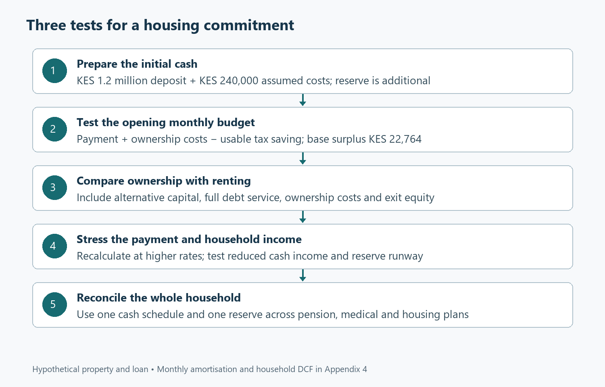

# A home the household can keep

*Kenyan tax and household finance; Part 4 of 4. Rules checked 7 September 2026. Prices, borrowing terms and growth rates are hypothetical. Companion: 04-Mortgages-and-Housing.xlsx and Appendix 4.*

## Ask what happens after the purchase

Buying a home often begins with a price and a monthly payment. The household asks whether it can assemble the deposit and whether the lender will approve the loan. Those are necessary questions, but they describe the beginning of the commitment. The more demanding question is whether the household can keep paying while continuing to fund ordinary life, retirement and medical protection. A home can provide stability and a valuable asset while also concentrating a large share of family wealth in something that is difficult to sell quickly. The financial conversation should therefore extend beyond approval. It needs to follow the loan, the property, the household’s cash and the alternative of renting through both comfortable and uncomfortable circumstances over the years that follow.

The earlier articles give us the pieces needed for that conversation. Part 1 distinguished taxable income from spendable cash. Part 2 examined retirement capital after fees and inflation. Part 3 tested medical costs alongside an interruption in earnings. Housing connects them because a mortgage payment can compete with every one of those obligations. This final article asks five questions. What is the full cash required to buy? How does each payment divide between interest and principal? What is the real value of a qualifying interest deduction? How does buying compare with renting on consistent financial assumptions? Finally, what happens if borrowing costs rise or household income falls? A purchase becomes easier to evaluate when those questions are answered separately and then considered together.

Our illustrative property costs KES 6 million. The buyer pays a 20% deposit and borrows KES 4.8 million for twenty years at a nominal annual rate of 13%, with monthly reducing-balance payments. Purchase costs are assumed to be 4% of the property price, selling costs 3%, annual property-price growth 3% and the first year’s comparable rent KES 360,000. Rent rises by 5% annually. These figures are scenario inputs, not market averages, a lender offer or statements of statutory transaction charges. Each should be replaced with the actual property and financing evidence before a real decision. The value of the exercise lies in making the comparison internally consistent, not in presenting an invented example as the representative Kenyan housing market.

The household has KES 125,000 a month available before housing, after the other commitments represented by that input, and KES 50,000 of non-housing essential spending. Its taxable pay before the mortgage-interest deduction is entered separately at KES 170,000, with KES 3,150 in monthly tax reliefs. These are standalone housing-case assumptions rather than a continuation of the KES 150,000 salary example in Part 1. Keeping the distinction explicit prevents the reader from trying to reconcile two different illustrative households as though they shared one payslip. A real user should bring the actual cash figure and taxable figure from their own payroll analysis. They perform different jobs in the mortgage workbook and should not be substituted for each other merely because both are monthly amounts.

## Count the cash needed to enter ownership

The deposit is KES 1.2 million. The assumed purchase-cost allowance adds KES 240,000, bringing the initial cash requirement to KES 1.44 million. The emergency reserve is additional. Equation (4.1) is **cash needed to buy = deposit + purchase costs**. Appendix 4 expands the arithmetic and distinguishes the deposit from the amount borrowed. The purchase-cost fraction is an all-in modelling allowance, not a claim that one legal charge applies at 4% in every case. Actual costs should be assembled from the transaction, including applicable taxes, legal work, valuation, registration and financing charges. A buyer who has saved exactly the deposit may still lack the cash needed to complete, furnish, move and retain a practical reserve after taking ownership.

There is also an opportunity cost to the initial cash. A renter who does not buy could retain or invest the deposit and purchase-cost amount, subject to realistic returns, taxes, charges and behaviour. A fair rent-versus-buy comparison needs to recognise that alternative. Otherwise, ownership receives credit for future property value while the renter’s starting capital quietly disappears from the analysis. Our model includes the initial cash as an outflow from buying and uses a stated after-tax, after-fee opportunity rate to value the later differences. This does not assume that every renter will actually invest with perfect discipline. It creates a financial comparison under explicit behaviour, which can then be discussed alongside the household’s likely habits and preferences rather than being confused with an automatic outcome.

The initial monthly loan payment is approximately KES 56,235.63. During the first month, interest is KES 52,000, leaving KES 4,235.63 to reduce principal. Equation (4.2) gives the accessible relationship: **principal repaid = loan payment − interest charged**. The payment formula itself and the full amortisation derivation belong in Appendix 4. This first-month split can surprise a buyer who expects every payment to create a large immediate increase in equity. The principal component grows as the balance falls under a constant-rate schedule, but early payments largely compensate the lender for the use of its money. Understanding that pattern helps the household interpret the loan statement and assess what a sale after only a few years might actually release.

Over the full twenty-year base schedule, projected interest totals approximately KES 8.70 million. That figure should not be used alone to declare the mortgage good or bad. It reflects the loan amount, rate and length of time over which financing is provided, and it ignores the timing value of money if simply compared with today’s property price. It is nevertheless a useful reminder that extending a term changes more than the immediate payment. A longer term can make the month easier while increasing total financing costs and leaving debt outstanding for longer. The workbook retains both the monthly schedule and the cumulative result so the household can see the trade-off. A lower payment is a cash-flow benefit whose longer-term cost still needs to be examined.

## Give the interest deduction its proper weight

Kenyan rules allow a deduction for qualifying mortgage interest within the stated limit, subject to the borrowing and owner-occupation conditions [1], [2]. The deduction concerns eligible interest rather than the whole loan payment. In the first month of our example, interest of KES 52,000 exceeds the KES 30,000 monthly ceiling used in the model. The workbook reduces taxable pay by the qualifying capped amount and recomputes PAYE using the progressive bands [3]. It does not subtract KES 30,000 from the mortgage payment or treat the deduction as a cash grant. This distinction is essential when a property is marketed through its tax advantages. The household must still finance the actual payment and should evaluate any tax benefit only after confirming that the loan and use of the property qualify.

For the stated taxable pay and reliefs, the first-month tax saving is KES 9,000. That leaves the financing payment after the immediate tax effect at KES 47,235.63, before ownership expenses. Equation (4.3) is **net housing cash cost = mortgage payment + ownership costs − usable tax saving**. With an assumed KES 5,000 monthly ownership-cost allowance, the initial cash cost becomes KES 52,235.63. The allowance covers a simplified combination of maintenance and other recurring ownership costs; a real buyer should replace it with a more specific budget. The model keeps the tax saving visible as a separate line so its scale can be understood. It helps, but it does not turn a substantial mortgage into a small commitment or remove the need to fund repairs and other costs.

The deduction’s value can change as the loan and household change. Interest may fall below the cap as principal is repaid. A different taxable income can move the deductible amount across tax bands. An interruption in earnings can reduce the tax available to save. The workbook therefore computes the difference between PAYE before and after the eligible deduction each month rather than multiplying every interest payment by a fixed marginal rate. This is a modest increase in modelling detail with a clear purpose: it prevents the tax benefit from continuing mechanically when the underlying conditions no longer support it. Appendix 4 shows the before-and-after tax arithmetic, while the amortisation sheet exposes the actual interest, capped deduction and tax saving for every scheduled month.

On the initial assumptions, the household’s monthly surplus after housing and other essentials is KES 22,764.37. That comes from KES 125,000 available cash, less KES 50,000 of other essentials, less the mortgage and ownership costs, plus the KES 9,000 tax saving. The result is positive, which establishes something useful but limited: the opening month fits inside the stated budget. It does not establish that the property is the best financial choice, that future payments remain comfortable or that the household has allowed for every irregular cost. Those are separate tests. Keeping the opening affordability result distinct from the valuation and stress results prevents a positive first-month number from carrying more reassurance than the assumptions behind it can support.

## Compare buying with a genuine rental alternative

The rent-versus-buy model compares the same housing need over a twenty-year horizon. Each year, it treats rent avoided as a benefit of buying and subtracts debt service and ownership costs, while adding the modelled tax saving. At the chosen exit date, it adds the property’s sale proceeds after selling costs, remaining debt and the entered exit-tax provision. The model does not assume that every property sale is tax-exempt. The zero exit-tax provision is an explicit scenario input to be replaced with the actual treatment and amount applicable to the transaction. This approach keeps the comparison focused on household cash and equity. It also avoids using a corporate valuation template whose business cash flows and perpetual terminal assumptions would be poorly matched to an owner-occupied home.

The first year’s financial difference favours renting. The buyer avoids KES 360,000 of rent but pays about KES 674,827.61 in debt service and KES 60,000 in ownership costs, offset by the assumed first-year tax saving. Later years change because rent and property value grow along their stated paths and the loan balance declines. It would be misleading to compare only the first year’s rent with the lifetime mortgage payment, just as it would be misleading to compare only the eventual property value with the initial deposit. The annual schedule places the cash flows on the same timeline. That is the foundation for the discounted comparison described next, and it gives the reader a way to inspect which years contribute most to the result.

We use a 9% nominal annual discount rate representing the assumed after-tax, after-fee opportunity cost of capital. The rate is a modelling choice, not a recommended investment return. It converts future cash differences into comparable values at the purchase date. The technical terms are discounted cash flow and net present value, but the household question is accessible: how much are the later advantages and disadvantages worth relative to the money committed today? Appendix 4 develops the full formula and explains why the initial cash is kept outside the spreadsheet’s standard NPV function. The main article needs only the interpretation. A positive buy-minus-rent result favours buying financially under the assumptions; a negative result favours the rental alternative represented by those same assumptions.

The base model produces a buy-minus-rent present value of approximately negative KES 732,621. Under this particular set of assumptions, renting has the financial advantage even though the opening mortgage budget has a positive monthly surplus. That combination is entirely possible. Affordability asks whether the household can meet the commitment; valuation compares the commitment with an alternative use of money. Neither result automatically determines the personal decision. A household may value permanence, control over the property, proximity to family or reduced exposure to relocation. Those benefits should be discussed openly rather than smuggled into an optimistic price-growth input. The model makes the financial trade-off visible so the buyer can decide whether the non-financial benefits are worth the cost implied by the comparison.

## Check the comparison from another direction

The workbook also calculates the renter’s terminal wealth advantage by accumulating the initial cash and subsequent annual differences at the same opportunity rate. At the end of twenty years, it is approximately KES 4.11 million. Discounting that amount back at 9% gives the same KES 732,621 advantage expressed in purchase-date money. This reconciliation is valuable because it tests the cash-flow model from a different direction. The present-value method and the terminal-wealth method should agree when timing, rates and cash flows are consistent. If they do not, investigate the treatment of the deposit, loan principal, sale proceeds or discount periods. Appendix 4 derives the identity and shows the numerical substitution rather than simply reporting that two spreadsheet cells happen to match.

Principal repayment is a common source of double counting. It is a cash outflow during ownership, but it also reduces the debt deducted from sale proceeds. The model includes both effects in their proper places. Removing principal from the payment comparison because it is called saving would understate the cash the buyer must fund. Adding the full property sale value without subtracting remaining debt would overstate the equity received on exit. A similar error occurs if a comparison charges the deposit as an initial cost and then separately deducts a full opportunity-cost amount while also discounting all cash flows at that same opportunity rate. The workbook uses one consistent valuation framework, and the appendix explains where the opportunity cost has already been incorporated.

Timing conventions also deserve an explicit note. The amortisation schedule is monthly, while the valuation aggregates operating cash differences at each year end. That convention simplifies the comparison and is applied consistently to rent, financing costs, ownership costs and tax savings. A model using exact monthly dates and a compatible monthly discount rate would produce a somewhat different present value. The annual treatment is not an exact daily lender model, and it should not be described as one. For the decision illustrated here, the convention is visible and auditable. If a transaction’s timing is material, such as a long construction period or staggered disbursements, the schedule should be expanded to those dates rather than relying on an annual approximation that conceals the financing pattern.

The discount sensitivity sheet varies the opportunity rate while holding the underlying annual housing cash flows constant. This is a genuine sensitivity analysis because the changed rate is applied to the actual cash-flow sequence, not used to adjust the final answer by an arbitrary percentage. The table shows how much the conclusion depends on the value placed on alternative uses of capital. Property growth, rent and ownership costs can be changed separately in the dated assumption grid. They should be varied for reasons the household can explain. A favourable conclusion that appears only after combining very strong property appreciation, very weak alternative returns and unusually low maintenance is a conclusion about that optimistic combination, not robust evidence that ownership will dominate in ordinary circumstances.

## Put the payment under pressure

Interest-rate risk has a direct household dimension. Campbell and Cocco’s research on mortgage choice analyses the interaction between mortgage structures, income circumstances and borrowing constraints [4]. Its setting does not supply a Kenyan mortgage recommendation, but it helps frame the question: can the household absorb the cash consequences of the chosen loan structure when conditions change? Our rate sensitivity reprices the initial loan at several nominal rates and recalculates the payment. It also recomputes the initial tax saving rather than assuming the deduction offsets every increase in interest. Because the deduction can already be capped, a higher borrowing rate may increase the payment without producing an equivalent additional tax benefit. The household experiences the difference in cash, regardless of how the loan is described in a brochure.

The workbook’s main amortisation schedule also allows the annual interest-rate assumption to change later in the loan. It recalculates the required payment over the remaining term using the outstanding balance. This is a stated recasting convention. An actual lender may use different reset dates, notice periods, floors, fees or treatment of prepayments. The borrower should obtain those terms before relying on a projected payment path. Extra principal in this model reduces the balance and leads to a recalculated payment, rather than automatically preserving the old payment and shortening the term. That choice is explained in the appendix because two prepayment models can produce different cash patterns while using the same extra amount. The contractual mechanism should determine which model is appropriate for the real loan.

The income stresses reduce the KES 125,000 available cash by selected fractions while holding the stated essential spending. For those disrupted-income cases, the model conservatively assumes no usable mortgage tax saving. This is a cash stress, not a fully reconstructed payslip at a lower gross salary. The distinction avoids pretending that an unspecified interruption has one precise payroll treatment. A 25% reduction in available cash, for example, can erase the opening surplus once the housing commitment and other essentials remain. The reserve-runway column then shows how long the separate KES 300,000 reserve would cover a continuing monthly deficit under the scenario. The calculation makes the pressure visible before the household is forced to discover it through missed payments or new borrowing.

Part 3 showed why income and medical stresses should eventually be considered together. A reserve used to bridge mortgage payments is no longer fully available for a residual hospital bill. The workbooks keep the reserve separate from the deposit and identify their own assumptions, but they do not create additional money when several risks occur at once. A real household should run a combined scenario using one opening reserve and one consolidated cash schedule. That exercise can reveal that a purchase comfortable in the base case leaves little capacity for a difficult year. The response might be a larger deposit, a less expensive property, a longer preparation period or a different financing arrangement. The point is to change the commitment while alternatives remain available.

## Account for the property you will actually own

Ownership costs should become specific before a purchase. A percentage allowance can organise an initial model, but it should eventually be replaced with service charges, insurance, rates, maintenance and likely major repairs relevant to the property. A new apartment, an older house and a property requiring immediate work will not have identical cash patterns. Some costs are regular; others arrive in large amounts. The same timing lesson from medical insurance applies here: an annual allowance does not guarantee that cash is available when a repair becomes urgent. If the property requires an early capital outlay, enter it at the appropriate date. Treating every cost as a smooth fraction of value can make ownership look easier to fund than the actual maintenance and service obligations suggest.

The rental alternative should be equally concrete. Compare a dwelling that meets a reasonably similar housing need, with realistic rent, escalation and moving costs. Comparing an expensive owned home with a much smaller rental can answer a useful lifestyle question, but it is not a pure comparison of financing the same housing service. The difference should be stated. Likewise, a household expecting to move in a few years should shorten the model horizon rather than keep a twenty-year sale date because it improves the purchase result. Entry and exit costs become more influential over short holding periods. A model earns its usefulness by adapting to the probable decision, not by selecting the horizon under which the desired decision appears most attractive.

Legal and property due diligence sit beside the financial model. The spreadsheet does not establish ownership, validate title, identify structural defects or confirm that a lender’s quoted terms match the final contract. Those matters can materially change both the costs and the asset being purchased. The right role for the model is to organise confirmed transaction information and reveal its implications. If a material item remains unknown, show it as an assumption to be resolved rather than burying it in an optimistic total. This is consistent with the broader household-finance perspective: financial decisions occur under constraints and imperfect information, so the process used to acquire reliable information is part of the decision’s quality [5]. Accurate arithmetic cannot compensate for a misdescribed property or obligation.

## Bring the four articles into one household decision

Before committing, assemble a single view of cash after payroll, pension and medical commitments, the proposed housing payment, ordinary spending and reserves. Check that annual premiums, school costs and repairs have not disappeared because the mortgage worksheet is monthly. Confirm that pension contributions entered in the retirement projection match what the household expects to keep paying after purchase. Confirm that the emergency reserve remains available after the deposit and transaction costs are paid. These are simple reconciliation tasks with significant consequences. Each workbook can be correct on its own while the combined plan is impossible if it assigns the same surplus or reserve to several purposes. The final household schedule should make those competing claims explicit and show the order in which they will be funded.

The illustrative purchase passes the opening cash test but loses to renting on the model’s financial-value test, and its comfort depends on continued income and the assumed borrowing terms. That is a useful result because it supports a more precise decision than a general argument that renting wastes money or that home ownership is always prudent. A household can choose the property for reasons it values, revise the price or financing, or continue renting while building flexibility. What matters is that the choice reflects the full commitment. Across the series, the same principle has guided the tax, pension, medical and housing calculations: follow the actual cash, state the assumptions, examine difficult scenarios and keep the detailed mathematics available for anyone who wants to test the conclusion.

## References

[1] Kenya Revenue Authority, “Allowable deductions,” FAQ 732. [Online]. Available: [KRA](https://www.kra.go.ke/component/kra_faq/faq/732). Accessed: Sep. 7, 2026.

[2] Republic of Kenya, *Tax Laws (Amendment) Act, No. 12 of 2024*, sec. 7, 2024. [Online]. Available: [Kenya Law](https://www.kenyalaw.org/kl/fileadmin/pdfdownloads/Acts/2024/TheTaxLaws_Amendment_Act_No.12of2024.pdf). Accessed: Sep. 7, 2026.

[3] Kenya Revenue Authority, “Pay As You Earn (PAYE).” [Online]. Available: [KRA](https://www.kra.go.ke/individual/filing-paying/types-of-taxes/paye). Accessed: Sep. 7, 2026.

[4] J. Y. Campbell and J. F. Cocco, “Household risk management and optimal mortgage choice,” *The Quarterly Journal of Economics*, vol. 118, no. 4, pp. 1449–1494, 2003, doi: [10.1162/003355303322552847](https://doi.org/10.1162/003355303322552847).

[5] J. Y. Campbell, “Household finance,” *The Journal of Finance*, vol. 61, no. 4, pp. 1553–1604, 2006, doi: [10.1111/j.1540-6261.2006.00883.x](https://doi.org/10.1111/j.1540-6261.2006.00883.x).
