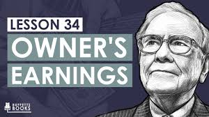
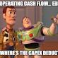
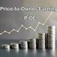
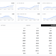
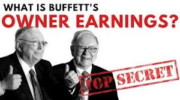

Warren Buffett's Owner's Earning

**AI Mode reply for Warren Buffett's Owner's Earning**

Warren Buffett's **owner's earnings** measure the true, sustainable cash that an owner can take out of a business each year without hurting its long-term operations or competitive strength. 

Old School Value +1

📊 The Formula

Owner's earnings are calculated using components from a company's financial statements: 

Seeking Alpha

Owner′s Earnings=Net Income+Depreciation, Depletion, & Amortization±Other Non-Cash Charges−Average Annual Maintenance Capital Expenditures±Changes in Working CapitalOwner prime s Earnings equals Net Income plus Depreciation, Depletion, & Amortization plus or minus Other Non-Cash Charges minus Average Annual Maintenance Capital Expenditures plus or minus Changes in Working Capital

Owner′s Earnings=Net Income+Depreciation, Depletion, & Amortization±Other Non-Cash Charges−Average Annual Maintenance Capital Expenditures±Changes in Working Capital

 

Finrepo +1

📌 Key Components Broken Down

- **Reported Earnings (Net Income):** The baseline profit from the income statement, though Buffett noted it can be distorted by accounting rules.

- **Non-Cash Add-Backs:** Depreciation, depletion, and amortization are added back because they reduce net income on paper but do not actually cost outgoing cash.

- **Maintenance Capital Expenditures (Capex):** Unlike standard Free Cash Flow (which subtracts all capital spending), owner's earnings subtract *only* the money needed to maintain the current competitive position, excluding growth-oriented expansion spending.

- **Working Capital Adjustments:** The cash required for inventory, receivables, and operational fluctuations to keep unit volume stable. 

> Yahoo Finance +5

💡 Why It Matters

Standard metrics like Net Income or Earnings Per Share (EPS) can be misleading because some businesses require massive, continuous cash injections (inflationary capex) just to stay in place. Owner's earnings strip away this accounting noise to reveal actual economic reality and cash generation. 

LinkedIn·George Atuan, CFA +1

If you'd like, I can:

- Walk through a **step-by-step calculation example** using a real company's financial numbers.

- Explain the difference between **maintenance capex and growth capex** in detail.

Let me know how you want to proceed!

AI responses may include mistakes. For financial advice, consult a professional. [<u>Learn more</u>](https://support.google.com/websearch?p=aimode)

Copied to clipboardFailed to copy to clipboard. Try again later.

CopiedFailed to copyCopy

**Share public link**

This public link shares a thread, which may include personal information. You can [<u>delete</u>](https://support.google.com/websearch/answer/16517651) this link, but not copies made by others.

Copy link

Can’t copy the link right now. Please try again later.

Facebook

Gmail

X

Reddit

WhatsApp

Share

Good response

Bad response

More

Export to Docs

Draft in Gmail

About this response

Saved time

Clear

Helpful

Comprehensive

Other

Incorrect

Inappropriate

Not working

Unhelpful

Other

A copy of this chat will be included.

A copy of this chat and the content that you shared will be included.

A copy of this chat and the content that you shared will be included.

Submit

Thanks for letting us know

Google may use account and system data to understand your feedback and improve our services, subject to our [<u>Privacy Policy</u>](https://policies.google.com/privacy) and [<u>Terms of Service</u>](https://policies.google.com/terms). For legal issues, [<u>make a legal removal request</u>](https://support.google.com/legal/answer/3110420).

**Shared**

0 files

- 

> Wikipedia
>
> Owner earnings - Wikipedia
>
> Owner earnings is a valuation method detailed by Warren Buffett in Berkshire Hathaway's annual report in 1986. He stated that the ...

- 

> 
>
> Old School Value
>
> What is Owner Earnings? (The Warren Buffett Guide)
>
> What is Owner Earnings? Owner Earnings is a valuation metric popularized by Warren Buffett that measures the actual cash a busines...
>
> 

- 

> Yahoo Finance
>
> Owner Earnings: Warren Buffett's Favorite Formula
>
> Buffett outlined his thoughts on owner earnings in his 1986 Berkshire Annual Shareholder Letter. He said that owner earnings inclu...

Show all

- 

> Wikipedia
>
> Owner earnings - Wikipedia
>
> Owner earnings is a valuation method detailed by Warren Buffett in Berkshire Hathaway's annual report in 1986. He stated that the ...

- 

> Old School Value
>
> What is Owner Earnings? (The Warren Buffett Guide)
>
> What is Owner Earnings? Owner Earnings is a valuation metric popularized by Warren Buffett that measures the actual cash a busines...
>
> 

- 

> Yahoo Finance
>
> Owner Earnings: Warren Buffett's Favorite Formula
>
> Buffett outlined his thoughts on owner earnings in his 1986 Berkshire Annual Shareholder Letter. He said that owner earnings inclu...

- 

> YouTube·Preston Pysh
>
> 34\. Warren Bufett's Owner's Earnings Calculation
>
> this okay so here's Warren Buffett's quote on owner's earnings. and this quote was pulled from his shareholder letters from 1986. ...
>
> 
>
> 3m

- 

> Seeking Alpha
>
> Owner Earnings: Warren Buffett's Favorite Formula - Seeking Alpha
>
> \* What are Owner's Earnings? \* Owner's Earnings = \* Breaking down the owners earning's Equation. \* Reported Earnings: This one is ...
>
> 

- 

> LinkedIn·George Atuan, CFA
>
> Why Buffett Ignores EPS — And You Should Too - LinkedIn
>
> Conclusion: Why Owner Earnings Matter In summary, owner earnings are Buffett's preferred yardstick for business value. It directly...
>
> 

- 

> Finrepo
>
> Price to Owner Earnings Ratio. Buffett's Formula - Finrepo
>
> FORMULA for calculations: \* PRICE-TO-OWNER-EARNINGS = Share Price / Owner Earnings per Share. \* OWNER-EARNINGS-PER-SHARE = (Net In...
>
> 

- 

> Old School Value
>
> Owner Earnings - Old School Value
>
> The Origin Story. In his 1986 Shareholder Letter, Warren Buffett introduced the world to "Owner Earnings." He argued that standard...
>
> 

- 

> YouTube·Andrew Or
>
> Warren Buffett's Owner Earnings Explained
>
> Warren Buffett's Owner Earnings Explained firstly a quick reminder on what is free cash flow free cash flow is money generated by ...
>
> 
>
> 4m

- 

> stokterminal.com
>
> Owner earnings: the metric Buffett prefers to net income
>
> What are owner earnings? Buffett's 1986 definition of a company's true earning power: net income, plus depreciation and other non-

Show less

Copied

Copy

Edit

How can Small Business Owners (USA) and MSME business owners use Owner's earnings. What are all the scenarios?

**AI Mode reply for How can Small Business Owners (USA) and MSME business owners use Owner's earnings. What are all the scenarios?**

For small business owners and Micro, Small, and Medium Enterprises (MSMEs), **owner’s earnings** is the ultimate metric for measuring the true cash-flow health of a business. 

While big corporations use it for stock valuation, small business owners can use it to determine exactly how much cash they can safely pull out of the business for personal use or how to price their business for an eventual sale. 

🌟 Why Owner's Earnings Matter More for MSMEs

Standard accounting metrics like Net Income can be deeply misleading for small businesses: 

- **The Net Income Trap:** A business can show a high Net Income of \$100,000 on paper, but if it had to spend \$90,000 on a new delivery truck just to stay competitive, the owner only has \$10,000 of real cash. 

- **The EBITDA Trap:** EBITDA completely ignores Depreciation and Capital Expenditures. If a machine shop ignores the eventual cost of replacing its CNC machines, it will eventually run out of cash. 

Owner's Earnings reconcile this by showing the **reinvestable reality** of your business operations. 

📊 Practical Scenarios for MSME Business Owners

1\. Deciding Personal Dividends vs. Business Reinvestment 

Many small business owners struggle to know how much money they can safely take home without starving the company. 

- **The Scenario:** You want to pay yourself a year-end bonus or distribute a dividend to equity partners.

- **The Strategy:** By calculating Owner’s Earnings, you subtract the "maintenance capex" (money needed to replace worn-out equipment, update software licenses, or refresh inventory) from your operating cash flow. The remaining balance is your true "discretionary cash." Taking anything less than this leaves a safety buffer; taking anything more actively damages the business's future capability. 

2\. Valuation for Selling or Buying a Business 

In the small business world, businesses are often valued on a metric called **Seller’s Discretionary Earnings (SDE)** or Owner's Earnings. 

- **The Scenario:** You are looking to sell your MSME or acquire a local competitor.

- **The Strategy:** A potential buyer wants to know: *"If I buy this business and step into the owner's shoes, how much actual cash drops into my pocket?"* Owner's earnings calculate exactly that. It adds back your personal perks (like a company vehicle or phone), non-cash depreciation, and subtracts the bare minimum required to keep the doors open, providing a highly accurate baseline for a valuation multiple (e.g., 2.5x to 4x Owner's Earnings). 

3\. Capital Allocation: "Growth" vs. "Maintenance" Decisions 

MSMEs often waste cash by confusing growth with survival. 

- **The Scenario:** You need to decide whether to buy a second retail location or upgrade your existing digital infrastructure.

- **The Strategy:** Owner's earnings force you to separate **Maintenance Capex** (the cost to maintain your *current* customer volume) from **Growth Capex** (the cost to acquire *new* volume). If your Owner's Earnings are consistently thin or negative, it means your current business model requires too much cash just to stand still. You should fix efficiency flaws before trying to expand. 

4\. Managing Working Capital During Inflation 

Small businesses are highly sensitive to sudden cost increases in inventory or accounts receivable. 

- **The Scenario:** Supply chain costs rise, requiring you to hold more expensive inventory just to fulfill the same number of orders.

- **The Strategy:** The "Changes in Working Capital" part of the formula acts as an early warning system. If your Net Income stays the same but your Owner's Earnings drop sharply, it reveals that cash is getting trapped in unsold inventory or unpaid customer invoices (receivables). 

➡️ Real-World MSME Comparison Example

To ground this, let's look at a direct comparison of two different types of small businesses, each making \$150,000 in paper Net Income. Notice how their actual Owner's Earnings diverge based on their operational realities. 

| **Metric**                     | **🚚 Business A: Local Fleet Delivery (Asset-Heavy)**                                                                  | **💻 Business B: Boutique Digital Agency (Asset-Light)**                                                                    |
|--------------------------------|------------------------------------------------------------------------------------------------------------------------|-----------------------------------------------------------------------------------------------------------------------------|
| **Reported Net Income**        | **\$150,000**                                                                                                          | **\$150,000**                                                                                                               |
| *(+) Depreciation*             | \$25,000 *(Trucks/Equipment wear)*                                                                                     | \$2,000 *(Laptops/Office furniture)*                                                                                        |
| *(-) Maintenance Capex*        | -\$45,000 *(Inevitable truck repairs/tire cycles)*                                                                     | -\$5,000 *(Software renewals/Hardware refreshes)*                                                                           |
| *(-/+) Working Capital Change* | -\$10,000 *(Pre-buying expensive fuel/parts)*                                                                          | +\$5,000 *(Clients paying upfront via retainers)*                                                                           |
| **True Owner's Earnings**      | **\$120,000**                                                                                                          | **\$152,000**                                                                                                               |
| **The Reality**                | Business A looks highly profitable, but the owner can only safely withdraw **\$120,000** without shrinking operations. | Business B actually generates *more* spendable cash than its reported profits. The owner can safely withdraw **\$152,000**. |

If you want to apply this directly to your situation, tell me:

- Do you operate an **asset-heavy business** (machinery, vehicles, heavy inventory) or an **asset-light business** (services, software, consulting)?

- Are you looking to use this for **day-to-day cash tracking**, or are you preparing the business for a **sale/valuation**?

Copied to clipboardFailed to copy to clipboard. Try again later.

CopiedFailed to copyCopy

**Share public link**

This public link shares a thread, which may include personal information. You can [<u>delete</u>](https://support.google.com/websearch/answer/16517651) this link, but not copies made by others.

Copy link

Can’t copy the link right now. Please try again later.

Facebook

Gmail

X

Reddit

WhatsApp

Share

Good response

Bad response

More

Export to Docs

Draft in Gmail

About this response

Saved time

Clear

Helpful

Comprehensive

Other

Incorrect

Inappropriate

Not working

Unhelpful

Other

A copy of this chat will be included.

A copy of this chat and the content that you shared will be included.

A copy of this chat and the content that you shared will be included.

Submit

Thanks for letting us know

Google may use account and system data to understand your feedback and improve our services, subject to our [<u>Privacy Policy</u>](https://policies.google.com/privacy) and [<u>Terms of Service</u>](https://policies.google.com/terms). For legal issues, [<u>make a legal removal request</u>](https://support.google.com/legal/answer/3110420).

**Shared**

0 files

Show less

Show all

Copied

Copy

Edit

Show how it's used for stock valuation

**AI Mode reply for Show how it's used for stock valuation**

In stock valuation, Wall Street and institutional investors use Warren Buffett’s **Owner’s Earnings** as the ultimate input for **Discounted Cash Flow (DCF)** models. While the broader market relies on standard Free Cash Flow (FCF), value investors modify it to Owner's Earnings to determine the intrinsic value of a company. 

If a stock trades below its calculated intrinsic value (incorporating a "margin of safety"), it is considered a buy. 

📊 The Core Strategy: Owner's Earnings DCF Valuation

To value a stock, an investor projects a company's Owner’s Earnings into the future and discounts those cash flows back to the present day using a chosen discount rate (usually the investor's required rate of return, often 10% to 12%). 

The Formula for Present Value of Future Cash Flows: 

Intrinsic Value=∑Owner′s Earningst(1+r)t+Terminal Value(1+r)nIntrinsic Value equals sum of the fraction with numerator Owner prime s Earnings sub t and denominator open paren 1 plus r close paren to the t-th power end-fraction plus the fraction with numerator Terminal Value and denominator open paren 1 plus r close paren to the n-th power end-fraction

Intrinsic Value=Owner′s Earnings𝑡(1+𝑟)𝑡+Terminal Value(1+𝑟)𝑛

- **t** = The specific year in the future.

- **r** = The discount rate.

- **Terminal Value** = The estimated worth of the company at the end of the projection period. 

🔎 Step-by-Step Stock Valuation Framework

To ground this, let's look at a concrete, hypothetical valuation of **Company XYZ**, an asset-heavy manufacturing stock. 

1\. Calculate Baseline Owner's Earnings 

First, we look at the company's financial statements to extract the true baseline cash flow: 

- **Net Income:** \$100 million

- **Depreciation & Amortization (D&A):** +\$20 million

- **Maintenance Capex:** -\$25 million *(Note: Total Capex was \$40M, but \$15M was spent on growth/building a new factory, so we only subtract the \$25M needed to maintain current production)*

- **Working Capital Adjustment:** -\$5 million *(Cash tied up in extra raw materials)* 

Owner′s Earnings=100+20−25−5=\$90 millionOwner prime s Earnings equals 100 plus 20 minus 25 minus 5 equals \$ 90 million

Owner′s Earnings=100+20−25−5=\$𝟗𝟎 million

2\. Project Growth and Discount to Present Value 

Assume we require a **10% annual return (discount rate)** and expect the company's Owner's Earnings to grow at **5% per year** for the next 5 years before reaching a stable, long-term terminal growth rate. 

python

\# Financial calculation for the 5-year DCF projection based on the user's proxy scenario

discount_rate = 0.10

growth_rate = 0.05

initial_oe = 90.0

nominal_flows = \[\]

present_values = \[\]

current_oe = initial_oe

for year in range(1, 6):

current_oe \*= (1 + growth_rate)

pv = current_oe / ((1 + discount_rate) \*\* year)

nominal_flows.append(round(current_oe, 2))

present_values.append(round(pv, 2))

print(f"Nominal Flows: {nominal_flows}")

print(f"Present Values: {present_values}")

print(f"Sum of PV (5 years): {round(sum(present_values), 2)}")

Use code with caution.

**Calculated Values from the Formula:** 

- **Year 1:** \$94.50M nominal → **\$85.91M** Present Value

- **Year 2:** \$99.23M nominal → **\$82.01M** Present Value

- **Year 3:** \$104.19M nominal → **\$78.28M** Present Value

- **Year 4:** \$109.40M nominal → **\$74.72M** Present Value

- **Year 5:** \$114.87M nominal → **\$71.33M** Present Value

- **Sum of 5-Year Present Value:** **\$392.25 million** 

3\. Calculate Terminal Value (TV) 

To value the company beyond year 5, we assume it grows at a conservative terminal rate of 3% indefinitely. Using the Gordon Growth Model:

Terminal Value=Year 5 OE×(1+0.03)Discount Rate−Terminal Growth Rate=114.87×1.030.10−0.03=\$1,689.81 millionTerminal Value equals the fraction with numerator Year 5 OE cross open paren 1 plus 0.03 close paren and denominator Discount Rate minus Terminal Growth Rate end-fraction equals the fraction with numerator 114.87 cross 1.03 and denominator 0.10 minus 0.03 end-fraction equals \$ 1 comma 689.81 million

Terminal Value=Year 5 OE×(1+0.03)Discount Rate−Terminal Growth Rate=114.87×1.030.10−0.03=\$1,689.81 million

Discounting that Terminal Value back to today:

PV of Terminal Value=1,689.81(1+0.10)5=\$1,049.24 millionPV of Terminal Value equals the fraction with numerator 1 comma 689.81 and denominator open paren 1 plus 0.10 close paren to the fifth power end-fraction equals \$ 1 comma 049.24 million

PV of Terminal Value=1,689.81(1+0.10)5=\$𝟏,𝟎𝟒𝟗.𝟐𝟒 million

4\. Determine Intrinsic Value Per Share 

- **Total Intrinsic Value:** \$392.25M (5-year PV) + \$1,049.24M (Terminal PV) = **\$1,441.49 million**

- **Shares Outstanding:** 20 million shares

- **Intrinsic Value Per Share:**

> \$
>
> 1
>
> ,
>
> 441.49
>
> M
>
> /20
>
> M
>
> =\$𝟕𝟐.𝟎𝟕
>
>  

📈 Direct Comparison: Traditional Metrics vs. Owner's Earnings

When valuing a stock, using standard market metrics instead of Owner's Earnings can easily trick you into overpaying for an asset-heavy business. 

| **Valuation Approach**         | **Input Metric**                     | **Metric Value** | **Derived Value Per Share**              | **The Valuation Risk**                                                                                                                                          |
|--------------------------------|--------------------------------------|------------------|------------------------------------------|-----------------------------------------------------------------------------------------------------------------------------------------------------------------|
| **P/E Ratio (Traditional)**    | Net Income                           | \$100M           | **\$80.00** *(Assuming 16x Multiple)*    | **Overvaluation:** Ignores the fact that \$25M of that profit *must* be immediately spent on maintaining factories, leaving less actual money for shareholders. |
| **Free Cash Flow (FCF)**       | Operating Cash Flow - Total Capex    | \$80M            | **\$64.06** *(Standard DCF)*             | **Undervaluation:** Incorrectly penalizes the company for spending \$15M on a growth project that will actually increase future wealth.                         |
| **Owner's Earnings (Buffett)** | Net Income + D&A - Maintenance Capex | \$90M            | **\$72.07** *(True DCF Intrinsic Value)* | **Accurate Pricing:** Captures precisely what the business can return to investors while perfectly isolating growth spending from operational survival.         |

⚠️ Critical Risk & Speculation Warning

Relying heavily on concentrated stock positions or single-asset DCF models carries inherent structural risks. If management misallocates capital, or if your growth assumptions are off by even 1%, the intrinsic value can collapse, resulting in a **total loss of capital**. Always frame individual stock valuations within a broadly diversified portfolio context and apply a **margin of safety** (e.g., only buying the stock if it trades 20–30% below your calculated \$72.07 intrinsic value). 

To help refine how you want to apply this stock valuation method, share a few preferences below: 

**Which type of stock are you analyzing?**

Asset-heavy manufacturing

Asset-light tech or software

Financial or banking institutions

Retail or consumer goods

**What is your primary goal with this model?**

Calculating precise intrinsic value

Comparing competing stock options

Spotting accounting manipulation

2 of 2

Skip

AI responses may include mistakes. For financial advice, consult a professional. [<u>Learn more</u>](https://support.google.com/websearch?p=aimode)

Copied to clipboardFailed to copy to clipboard. Try again later.

CopiedFailed to copyCopy

**Share public link**

This public link shares a thread, which may include personal information. You can [<u>delete</u>](https://support.google.com/websearch/answer/16517651) this link, but not copies made by others.

Copy link

Can’t copy the link right now. Please try again later.

Facebook

Gmail

X

Reddit

WhatsApp

Share

Good response

Bad response

More

Export to Docs

Draft in Gmail

About this response

Saved time

Clear

Helpful

Comprehensive

Other

Incorrect

Inappropriate

Not working

Unhelpful

Other

A copy of this chat will be included.

A copy of this chat and the content that you shared will be included.

A copy of this chat and the content that you shared will be included.

Submit

Thanks for letting us know

Google may use account and system data to understand your feedback and improve our services, subject to our [<u>Privacy Policy</u>](https://policies.google.com/privacy) and [<u>Terms of Service</u>](https://policies.google.com/terms). For legal issues, [<u>make a legal removal request</u>](https://support.google.com/legal/answer/3110420).

**Shared**

0 files

Show less

Show all

Copied

Copy

Edit

Here are my choices: Q: "Which type of stock are you analyzing?" A: "Asset-light tech or software" Q: "What is your primary goal with this model?" A: "Calculating precise intrinsic value"

**AI Mode reply for Here are my choices: Q: "Which type of stock are you analyzing?" A: "Asset-light tech or software" Q: "What is your primary goal with this model?" A: "Calculating precise intrinsic value"**

When analyzing **asset-light technology or software stocks** to calculate a precise intrinsic value, Warren Buffett’s Owner’s Earnings framework requires a critical strategic shift. 

For standard companies, the main challenge is identifying *Maintenance Capital Expenditures*. For tech companies, physical equipment is rarely the issue. Instead, the real "wealth-degrading" operational costs hide directly inside the operating expenses: **Stock-Based Compensation (SBC)** and **Capitalized Software Development Costs**. 

🔎 Adjusting the Formula for Software & Tech Stocks

To find the precise intrinsic value of a software company, the traditional Owner's Earnings formula must be reframed to capture these hidden economic realities: 

\text{Tech Owner's Earnings} = \text{Net Income} + \text{D&A} - \text{Stock-Based Compensation (SBC)} - \text{Capitalized R&D} \pm \text{Changes in Deferred Revenue}

Why These Adjustments Matter: 

- **Stock-Based Compensation (SBC):** Tech companies love adding SBC back to regular "Free Cash Flow" because it is a non-cash expense. However, Buffett strongly opposes this practice. SBC is a real corporate expense that dilutes existing shareholders. To protect your valuation, you **must treat SBC as a cash expense** and subtract it. 

- **Capitalized R&D / Software Development:** Some software companies capitalize their engineering hours as an asset on the balance sheet instead of expensing them immediately. This artificially inflates Net Income. We must subtract any capitalized software costs that are required just to keep the product functional and secure. 

- **Deferred Revenue:** SaaS companies often collect cash for 12-month subscriptions upfront. This creates a massive cash influx today that isn't recognized as Net Income yet. Tracking changes in deferred revenue ensures you capture this structural advantage accurately. 

📊 Concrete Asset Grounding: Tech Valuation Blueprint

Let's model the valuation of a fast-growing, asset-light enterprise SaaS company (**Company TechX**). 

1\. Calculate Baseline Tech Owner's Earnings 

- **Reported Net Income:** \$200 million

- **Depreciation & Amortization (D&A):** +\$10 million *(minimal physical assets)*

- **Stock-Based Compensation (SBC):** -\$45 million *(dilution adjustment)*

- **Capitalized Software Maintenance:** -\$15 million *(core platform updates)*

- **Increase in Deferred Revenue:** +\$20 million *(upfront cash collected from new contracts)* 

Tech Owner′s Earnings=200+10−45−15+20=\$170 millionTech Owner prime s Earnings equals 200 plus 10 minus 45 minus 15 plus 20 equals \$ 170 million

Tech Owner′s Earnings=200+10−45−15+20=\$𝟏𝟕𝟎 million

2\. 5-Year DCF Projection & Growth Curve 

Because software businesses scale efficiently, we will project a **12% annual growth rate** for the first 5 years. We will apply a **9% discount rate** (reflecting a standard required return for a dominant software player) and a conservative **3% terminal growth rate**. 

python

\# Tech DCF computation for Company TechX

discount_rate_tech = 0.09

growth_rate_tech = 0.12

initial_toe = 170.0

nominal_tech_flows = \[\]

pv_tech_values = \[\]

current_toe = initial_toe

for year in range(1, 6):

current_toe \*= (1 + growth_rate_tech)

pv = current_toe / ((1 + discount_rate_tech) \*\* year)

nominal_tech_flows.append(round(current_toe, 2))

pv_tech_values.append(round(pv, 2))

print(f"Nominal Tech Flows: {nominal_tech_flows}")

print(f"PV Tech Values: {pv_tech_values}")

print(f"Sum of Tech PV (5 years): {round(sum(pv_tech_values), 2)}")

Use code with caution.

**Calculated Values from the Execution:** 

- **Year 1:** \$190.40M nominal → **\$174.68M** Present Value

- **Year 2:** \$213.25M nominal → **\$179.49M** Present Value

- **Year 3:** \$238.84M nominal → **\$184.42M** Present Value

- **Year 4:** \$267.50M nominal → **\$189.50M** Present Value

- **Year 5:** \$299.60M nominal → **\$194.72M** Present Value

- **Sum of 5-Year Cash Flows:** **\$922.81 million** 

3\. Terminal Value Calculation 

Using the Gordon Growth Model for the post-year-5 period:

Terminal Value=Year 5 TOE×(1+0.03)0.09−0.03=299.60×1.030.06=\$5,143.13 millionTerminal Value equals the fraction with numerator Year 5 TOE cross open paren 1 plus 0.03 close paren and denominator 0.09 minus 0.03 end-fraction equals the fraction with numerator 299.60 cross 1.03 and denominator 0.06 end-fraction equals \$ 5 comma 143.13 million

Terminal Value=Year 5 TOE×(1+0.03)0.09−0.03=299.60×1.030.06=\$5,143.13 million

Discounting the Terminal Value to the present:

PV of Terminal Value=5,143.13(1+0.09)5=\$3,342.69 millionPV of Terminal Value equals the fraction with numerator 5 comma 143.13 and denominator open paren 1 plus 0.09 close paren to the fifth power end-fraction equals \$ 3 comma 342.69 million

PV of Terminal Value=5,143.13(1+0.09)5=\$𝟑,𝟑𝟒𝟐.𝟔𝟗 million

4\. Final Intrinsic Value Extraction 

- **Total Enterprise Intrinsic Value:** \$922.81M (5-year PV) + \$3,342.69M (Terminal PV) = **\$4,265.50 million**

- **Diluted Shares Outstanding:** 50 million shares *(Important: Always use fully diluted shares to account for outstanding employee options!)*

- **Precise Intrinsic Value Per Share:**

> \$
>
> 4
>
> ,
>
> 265.50
>
> M
>
> /50
>
> M
>
> =\$𝟖𝟓.𝟑𝟏
>
>  

📈 Ticker Study: Where FCF Distorts Tech Reality

To see how standard metrics hide systemic issues compared to Owner's Earnings, look at how Wall Street's favorite calculations treat aggressive dilution: 

| **Metric Applied**          | **Treatment of Stock-Based Comp (SBC)**        | **Derived Per-Share Value** | **The Valuation Trap**                                                                                                                                                                                             |
|-----------------------------|------------------------------------------------|-----------------------------|--------------------------------------------------------------------------------------------------------------------------------------------------------------------------------------------------------------------|
| **Standard Free Cash Flow** | Added back completely as "non-cash"            | **\$105.50**                | **Overvaluation:** Ignores the heavy structural dilution occurring every year. The business looks like it generates abundant free cash, but existing shareholders are quietly owning less of it over time.         |
| **Tech Owner's Earnings**   | Expensed completely to reflect equity dilution | **\$85.31**                 | **Precise Intrinsic Value:** Recognizes that giving away shares to employees is a true economic cost. It provides a highly accurate reflection of what a private buyer would actually value the business at today. |

Would you like to look up the exact financial data for a specific **tech ticker** (e.g., Salesforce, Microsoft, or Palantir) so we can map out its actual **Stock-Based Compensation** and calculate a real-world intrinsic value?
